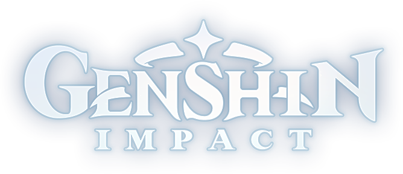

  

<table align="center">
  <tr>
    <th align="center" colspan="2">
      
    </th>
  </tr>
  <tr>
    <td align="center">
      <a
        href="#----profile-information--"
      >
        Genshin Impact Stats</a
      >
    </td>
    <td align="center">
      <a
        href="#----profile-information---1"
      >
        Honkai: Star Rail Stats</a
      >
    </td>
  </tr>
  <tr>
    <td align="center">
      <a
        href="#----characters--"
      >
        Genshin Impact Characters</a
      >
    </td>
    <td align="center">
      <a
        href="#----characters---1"
      >
        Honkai: Star Rail Characters</a
      >
    </td>
  </tr>
  <tr></tr>
</table>
<h3 align="center">
  🕒 Updated at <u>Nov 23, 2023 11:56 +0700</u> (🤖Automated)
</h3>
 

  

  

 

  

<h2 align="center">
  
  Profile Information
  
</h2>
<table align="center">
  <tr>
    <th rowspan="2" align="center">
      
    </th>
    <td colspan="2" align="center">
      
      <b>IPEACHA</b> <code>Lv. 60</code>
    </td>
  </tr>
  <tr>
    <td align="center"><b>Asia Server</b></td>
    <td align="center"><b>UID Hide</b></td>
  </tr>
</table>

<h2 align="center">
   Daily Rewards Genshin
  Impact 
</h2>
<table align="center">
  <tr>
    <td align="center"><b>Total Rewards Claimed:</b> <code>14</code></td>
  </tr>
  <tr>
    <td align="center">
      <b>Last Claimed Reward:</b> <a
        href="https://act.hoyolab.com/ys/event/signin-sea-v3/index.html?act_id=e202102251931481"
        ></a
      > 
      <b>8000 x Mora</b>
    </td>
  </tr>
  <tr>
    <td align="center"><b>Last Checked: 🕒 2023-11-23 00:05:58+08:00</b></td>
  </tr>
</table>

<h2 align="center">
  
  Stats
  
</h2>
<table align="center">
  <tr>
    <td>
      
      Achievements
    </td>
    <td align="center"><b>786</b></td>
  </tr>
  <tr>
    <td>
      
      Days Active
    </td>
    <td align="center"><b>898</b></td>
  </tr>
  <tr>
    <td>
      
      Characters
    </td>
    <td align="center"><b>58</b></td>
  </tr>
  <tr>
    <td>
       Waypoints Unlocked
    </td>
    <td align="center"><b>361</b></td>
  </tr>
  <tr>
    <td>
      
      Anemoculus
    </td>
    <td align="center"><b>66</b></td>
  </tr>
  <tr>
    <td>
      
      Geoculus
    </td>
    <td align="center"><b>131</b></td>
  </tr>
  <tr>
    <td>
       Electroculus
    </td>
    <td align="center"><b>181</b></td>
  </tr>
  <tr>
    <td>
      
      Dendroculus
    </td>
    <td align="center"><b>171</b></td>
  </tr>
  <tr>
    <td>
      
      Hydroculus
    </td>
    <td align="center"><b>13</b></td>
  </tr>
  <tr>
    <td>
       Common Chests
      Opened
    </td>
    <td align="center"><b>2054</b></td>
  </tr>
  <tr>
    <td>
       Exquisite
      Chests Opened
    </td>
    <td align="center"><b>1364</b></td>
  </tr>
  <tr>
    <td>
       Precious Chests
      Opened
    </td>
    <td align="center"><b>389</b></td>
  </tr>
  <tr>
    <td>
       Luxurious
      Chests Opened
    </td>
    <td align="center"><b>156</b></td>
  </tr>
  <tr>
    <td>
       Remarkable Chests
      Opened
    </td>
    <td align="center"><b>115</b></td>
  </tr>
  <tr>
    <td>
       Domains Unlocked
    </td>
    <td align="center"><b>55</b></td>
  </tr>
  <tr>
    <td>
       Spiral Abyss
    </td>
    <td align="center"><b>10-3</b></td>
  </tr>
</table>

<h2 align="center">
  
  Exploration
  
</h2>
<table align="center">
  <tr>
    <th>
      
      Fontaine
    </th>
    <th>
      
      Sumeru
    </th>
    <th>
      
      The Chasm: Underground Mines
    </th>
    <th>
      
      The Chasm
    </th>
    <th>
      
      Enkanomiya
    </th>
    <th>
      
      Inazuma
    </th>
    <th>
      
      Dragonspine
    </th>
    <th>
      
      Liyue
    </th>
    <th>
      
      Mondstadt
    </th>
  </tr>
  <tr>
    <td>
      

        
      

    </td>
    <td>
      

        
      

    </td>
    <td>
      

        
      

    </td>
    <td>
      

        
      

    </td>
    <td>
      

        
      

    </td>
    <td>
      

        
      

    </td>
    <td>
      

        
      

    </td>
    <td>
      

        
      

    </td>
    <td>
      

        
      

    </td>
  </tr>
  <tr>
    <td>
      <table>
        <tr>
          <td>Explored</td>
          <td>
            
          </td>
        </tr>
        <tr>
          <td>Reputation</td>
          <td align="center">3</td>
        </tr>
      </table>
    </td>
    <td>
      <table>
        <tr>
          <td>Explored</td>
          <td>
            
          </td>
        </tr>
        <tr>
          <td>Reputation</td>
          <td align="center">10</td>
        </tr>
      </table>
    </td>
    <td>
      <table>
        <tr>
          <td>Explored</td>
          <td>
            
          </td>
        </tr>
        <tr>
          <td>Offering</td>
          <td align="center">10</td>
        </tr>
      </table>
    </td>
    <td>
      <table>
        <tr>
          <td>Explored</td>
          <td>
            
          </td>
        </tr>
        <tr>
          <td>Offering</td>
          <td align="center">10</td>
        </tr>
      </table>
    </td>
    <td>
      <table>
        <tr>
          <td>Explored</td>
          <td>
            
          </td>
        </tr>
        <tr>
          <td>Offering</td>
          <td align="center">0</td>
        </tr>
      </table>
    </td>
    <td>
      <table>
        <tr>
          <td>Explored</td>
          <td>
            
          </td>
        </tr>
        <tr>
          <td>Reputation</td>
          <td align="center">10</td>
        </tr>
      </table>
    </td>
    <td>
      <table>
        <tr>
          <td>Explored</td>
          <td>
            
          </td>
        </tr>
        <tr>
          <td>Offering</td>
          <td align="center">12</td>
        </tr>
      </table>
    </td>
    <td>
      <table>
        <tr>
          <td>Explored</td>
          <td>
            
          </td>
        </tr>
        <tr>
          <td>Reputation</td>
          <td align="center">8</td>
        </tr>
      </table>
    </td>
    <td>
      <table>
        <tr>
          <td>Explored</td>
          <td>
            
          </td>
        </tr>
        <tr>
          <td>Reputation</td>
          <td align="center">8</td>
        </tr>
      </table>
    </td>
  </tr>
</table>
<h2 align="center">
  
  Serenitea Pot
  
</h2>
<table align="center">
  <tr>
    <td colspan="2" align="center">
       
      <b>Stately</b>
    </td>
  </tr>
  <tr>
    <td>
      
      <b>Highest Adeptal Energy</b>
    </td>
    <td align="center"><code>12140</code></td>
  </tr>
  <tr>
    <td>
      
      <b>Total Furnishings Obtained</b>
    </td>
    <td align="center"><code>1016</code></td>
  </tr>
  <tr>
    <td>
      
      <b>Trust Rank</b>
    </td>
    <td align="center"><code>10</code></td>
  </tr>
  <tr>
    <td>
      
      <b>Visitor History</b>
    </td>
    <td align="center"><code>7</code></td>
  </tr>
</table>
<h2 align="center">
  
  Spiral Abyss
  
</h2>
<table align="center">
  <tr>
    <td colspan="2" align="center">
       Season:
      <b>82</b>
    </td>
  </tr>
  <tr>
    <td align="center">
       Max Floor:
      <b>10-3</b>
    </td>
    <td align="center">
       Total Battles:
      <b>6</b>
    </td>
  </tr>
  <tr>
    <td align="center">
       Total Wins: <b>6</b>
    </td>
    <td align="center">
       Total Stars: <b>18</b>
    </td>
  </tr>
  <tr>
    <td colspan="2" align="center">
      🕐 Start Time: <b>2023-11-15 20:00:00+00:00</b>
    </td>
  </tr>
  <tr>
    <td colspan="2" align="center">
      🕛 End Time: <b>2023-11-30 19:59:59+00:00</b>
    </td>
  </tr>
  <tr>
    <td>Most Played Characters</td>
    <td>
      
      <b>Baizhu</b> <code>(6)</code> 
      <b>Nilou</b> <code>(6)</code> 
      <b>Furina</b> <code>(6)</code> 
      <b>Nahida</b> <code>(6)</code> 
    </td>
  </tr>
  <tr>
    <td>Most Defeats</td>
    <td>
      
      <b>Hu Tao</b> <code>(17)</code> 
    </td>
  </tr>
  <tr>
    <td>Strongest Single Strike</td>
    <td>
      
      <b>Hu Tao</b> <code>(522612)</code> 
    </td>
  </tr>
  <tr>
    <td>Most Damage Taken</td>
    <td>
      
      <b>Furina</b> <code>(27121)</code> 
    </td>
  </tr>
  <tr>
    <td>Elemental Bursts Unleashed</td>
    <td>
      
      <b>Furina</b> <code>(5)</code> 
    </td>
  </tr>
  <tr>
    <td>Elemental Skills Cast</td>
    <td>
      
      <b>Kaedehara Kazuha</b> <code>(10)</code> 
    </td>
  </tr>
</table>
<h2 align="center">
   Diary
  
</h2>
<table align="center">
  <tr>
    <td align="center">
      
      Primogems earned
    </td>
    <td align="center"><b>4638</b> <code>(rate 469)</code></td>
  </tr>
  <tr>
    <td align="center">
      
      Mora earned
    </td>
    <td align="center"><b>4206465</b> <code>(rate 1053)</code></td>
  </tr>
  <tr>
    <td align="center">
       Categories
    </td>
    <td>
      Mail: <b>1170</b> <code>(26%)</code> Quests: <b>860</b>
      <code>(19%)</code> Events: <b>820</b> <code>(18%)</code
      > Adventure: <b>691</b> <code>(14%)</code> Daily Activity:
      <b>610</b> <code>(13%)</code> Spiral Abyss: <b>450</b>
      <code>(9%)</code> Other: <b>37</b> <code>(1%)</code> 
    </td>
  </tr>
</table>

  

<h2 align="center">
  
  Characters
  
</h2>

  

    <b> Kamisato Ayaka</b>
  

   
  <table align="center">
    <tr>
      <th>
        <h3 align="center">
          
          Kamisato Ayaka
        </h3>
      </th>
      <th>
        <h3 align="center">
          
          Kagotsurube Isshin
        </h3>
      </th>
    </tr>
    <tr>
      <td>
        

          
        

      </td>
      <td>
        

          
        

      </td>
    </tr>
    <tr>
      <td>
        <table align="center">
          <tr>
            <td>Rarity</td>
            <td align="center">⭐⭐⭐⭐⭐</td>
          </tr>
          <tr>
            <td>Element</td>
            <td align="center">
              
              Cryo
            </td>
          </tr>
          <tr>
            <td>Level</td>
            <td align="center"><code>+90</code></td>
          </tr>
          <tr>
            <td>Friendship</td>
            <td align="center"><code>+10</code></td>
          </tr>
          <tr>
            <td>Constellation</td>
            <td align="center"><code>0</code></td>
          </tr>
          <tr>
            <td>
              Artifacts 2 x Noblesse Oblige 1 x Gilded Dreams 2 x
              Blizzard Strayer 
            </td>
            <td align="center">
              
              <code>+0</code> 
              ⭐⭐⭐⭐⭐ 
              Royal Flora 
              <code>+20</code> 
              ⭐⭐⭐⭐⭐ 
              Feather of Judgment 
              <code>+20</code> 
              ⭐⭐⭐⭐⭐ 
              Frozen Homeland's Demise 
              <code>+20</code> 
              ⭐⭐⭐⭐⭐ 
              Royal Silver Urn 
              <code>+20</code> 
              ⭐⭐⭐⭐⭐ 
              Broken Rime's Echo 
            </td>
          </tr>
          <tr>
            <td>Outfits</td>
            <td align="center"></td>
          </tr>
        </table>
      </td>
      <td valign="top">
        <table align="center">
          <tr>
            <td>Name</td>
            <td align="center">Kagotsurube Isshin</td>
          </tr>
          <tr>
            <td>Type</td>
            <td align="center">Sword</td>
          </tr>
          <tr>
            <td>Rarity</td>
            <td align="center">⭐⭐⭐⭐</td>
          </tr>
          <tr>
            <td>Level</td>
            <td align="center"><code>+1</code></td>
          </tr>
          <tr>
            <td>Ascension</td>
            <td align="center"><code>0</code></td>
          </tr>
          <tr>
            <td>Refinement</td>
            <td align="center"><code>1</code></td>
          </tr>
        </table>
      </td>
    </tr>
  </table>

  

    <b> Jean</b>
  

   
  <table align="center">
    <tr>
      <th>
        <h3 align="center">
          
          Jean
        </h3>
      </th>
      <th>
        <h3 align="center">
          
          Aquila Favonia
        </h3>
      </th>
    </tr>
    <tr>
      <td>
        

          
        

      </td>
      <td>
        

          
        

      </td>
    </tr>
    <tr>
      <td>
        <table align="center">
          <tr>
            <td>Rarity</td>
            <td align="center">⭐⭐⭐⭐⭐</td>
          </tr>
          <tr>
            <td>Element</td>
            <td align="center">
              
              Anemo
            </td>
          </tr>
          <tr>
            <td>Level</td>
            <td align="center"><code>+90</code></td>
          </tr>
          <tr>
            <td>Friendship</td>
            <td align="center"><code>+10</code></td>
          </tr>
          <tr>
            <td>Constellation</td>
            <td align="center"><code>3</code></td>
          </tr>
          <tr>
            <td>
              Artifacts 4 x Viridescent Venerer 1 x Emblem of Severed
              Fate 
            </td>
            <td align="center">
              
              <code>+20</code> 
              ⭐⭐⭐⭐⭐ 
              In Remembrance of Viridescent Fields 
              <code>+20</code> 
              ⭐⭐⭐⭐⭐ 
              Viridescent Arrow Feather 
              <code>+20</code> 
              ⭐⭐⭐⭐⭐ 
              Viridescent Venerer's Determination 
              <code>+20</code> 
              ⭐⭐⭐⭐⭐ 
              Viridescent Venerer's Vessel 
              <code>+20</code> 
              ⭐⭐⭐⭐⭐ 
              Ornate Kabuto 
            </td>
          </tr>
          <tr>
            <td>Outfits</td>
            <td align="center">
               
              Sea Breeze Dandelion, Gunnhildr's Legacy  
              Sea Breeze Dandelion, Gunnhildr's Legacy 
            </td>
          </tr>
        </table>
      </td>
      <td valign="top">
        <table align="center">
          <tr>
            <td>Name</td>
            <td align="center">Aquila Favonia</td>
          </tr>
          <tr>
            <td>Type</td>
            <td align="center">Sword</td>
          </tr>
          <tr>
            <td>Rarity</td>
            <td align="center">⭐⭐⭐⭐⭐</td>
          </tr>
          <tr>
            <td>Level</td>
            <td align="center"><code>+90</code></td>
          </tr>
          <tr>
            <td>Ascension</td>
            <td align="center"><code>6</code></td>
          </tr>
          <tr>
            <td>Refinement</td>
            <td align="center"><code>2</code></td>
          </tr>
        </table>
      </td>
    </tr>
  </table>

  

    <b> Zhongli</b>
  

   
  <table align="center">
    <tr>
      <th>
        <h3 align="center">
          
          Zhongli
        </h3>
      </th>
      <th>
        <h3 align="center">
          
          Black Tassel
        </h3>
      </th>
    </tr>
    <tr>
      <td>
        

          
        

      </td>
      <td>
        

          
        

      </td>
    </tr>
    <tr>
      <td>
        <table align="center">
          <tr>
            <td>Rarity</td>
            <td align="center">⭐⭐⭐⭐⭐</td>
          </tr>
          <tr>
            <td>Element</td>
            <td align="center">
              
              Geo
            </td>
          </tr>
          <tr>
            <td>Level</td>
            <td align="center"><code>+90</code></td>
          </tr>
          <tr>
            <td>Friendship</td>
            <td align="center"><code>+10</code></td>
          </tr>
          <tr>
            <td>Constellation</td>
            <td align="center"><code>0</code></td>
          </tr>
          <tr>
            <td>
              Artifacts 4 x Tenacity of the Millelith 1 x Wanderer's
              Troupe 
            </td>
            <td align="center">
              
              <code>+20</code> 
              ⭐⭐⭐⭐⭐ 
              Flower of Accolades 
              <code>+20</code> 
              ⭐⭐⭐⭐⭐ 
              Ceremonial War-Plume 
              <code>+20</code> 
              ⭐⭐⭐⭐⭐ 
              Orichalceous Time-Dial 
              <code>+20</code> 
              ⭐⭐⭐⭐⭐ 
              Wanderer's String-Kettle 
              <code>+20</code> 
              ⭐⭐⭐⭐⭐ 
              General's Ancient Helm 
            </td>
          </tr>
          <tr>
            <td>Outfits</td>
            <td align="center"></td>
          </tr>
        </table>
      </td>
      <td valign="top">
        <table align="center">
          <tr>
            <td>Name</td>
            <td align="center">Black Tassel</td>
          </tr>
          <tr>
            <td>Type</td>
            <td align="center">Polearm</td>
          </tr>
          <tr>
            <td>Rarity</td>
            <td align="center">⭐⭐⭐</td>
          </tr>
          <tr>
            <td>Level</td>
            <td align="center"><code>+80</code></td>
          </tr>
          <tr>
            <td>Ascension</td>
            <td align="center"><code>5</code></td>
          </tr>
          <tr>
            <td>Refinement</td>
            <td align="center"><code>5</code></td>
          </tr>
        </table>
      </td>
    </tr>
  </table>

  

    <b> Albedo</b>
  

   
  <table align="center">
    <tr>
      <th>
        <h3 align="center">
          
          Albedo
        </h3>
      </th>
      <th>
        <h3 align="center">
          
          Cinnabar Spindle
        </h3>
      </th>
    </tr>
    <tr>
      <td>
        

          
        

      </td>
      <td>
        

          
        

      </td>
    </tr>
    <tr>
      <td>
        <table align="center">
          <tr>
            <td>Rarity</td>
            <td align="center">⭐⭐⭐⭐⭐</td>
          </tr>
          <tr>
            <td>Element</td>
            <td align="center">
              
              Geo
            </td>
          </tr>
          <tr>
            <td>Level</td>
            <td align="center"><code>+90</code></td>
          </tr>
          <tr>
            <td>Friendship</td>
            <td align="center"><code>+10</code></td>
          </tr>
          <tr>
            <td>Constellation</td>
            <td align="center"><code>0</code></td>
          </tr>
          <tr>
            <td>
              Artifacts 4 x Husk of Opulent Dreams 1 x Flower of
              Paradise Lost 
            </td>
            <td align="center">
              
              <code>+20</code> 
              ⭐⭐⭐⭐⭐ 
              Bloom Times 
              <code>+20</code> 
              ⭐⭐⭐⭐⭐ 
              Plume of Luxury 
              <code>+20</code> 
              ⭐⭐⭐⭐⭐ 
              Song of Life 
              <code>+20</code> 
              ⭐⭐⭐⭐⭐ 
              Calabash of Awakening 
              <code>+20</code> 
              ⭐⭐⭐⭐⭐ 
              Amethyst Crown 
            </td>
          </tr>
          <tr>
            <td>Outfits</td>
            <td align="center"></td>
          </tr>
        </table>
      </td>
      <td valign="top">
        <table align="center">
          <tr>
            <td>Name</td>
            <td align="center">Cinnabar Spindle</td>
          </tr>
          <tr>
            <td>Type</td>
            <td align="center">Sword</td>
          </tr>
          <tr>
            <td>Rarity</td>
            <td align="center">⭐⭐⭐⭐</td>
          </tr>
          <tr>
            <td>Level</td>
            <td align="center"><code>+90</code></td>
          </tr>
          <tr>
            <td>Ascension</td>
            <td align="center"><code>6</code></td>
          </tr>
          <tr>
            <td>Refinement</td>
            <td align="center"><code>5</code></td>
          </tr>
        </table>
      </td>
    </tr>
  </table>

  

    <b> Hu Tao</b>
  

   
  <table align="center">
    <tr>
      <th>
        <h3 align="center">
          
          Hu Tao
        </h3>
      </th>
      <th>
        <h3 align="center">
          
          Deathmatch
        </h3>
      </th>
    </tr>
    <tr>
      <td>
        

          
        

      </td>
      <td>
        

          
        

      </td>
    </tr>
    <tr>
      <td>
        <table align="center">
          <tr>
            <td>Rarity</td>
            <td align="center">⭐⭐⭐⭐⭐</td>
          </tr>
          <tr>
            <td>Element</td>
            <td align="center">
              
              Pyro
            </td>
          </tr>
          <tr>
            <td>Level</td>
            <td align="center"><code>+90</code></td>
          </tr>
          <tr>
            <td>Friendship</td>
            <td align="center"><code>+10</code></td>
          </tr>
          <tr>
            <td>Constellation</td>
            <td align="center"><code>0</code></td>
          </tr>
          <tr>
            <td>
              Artifacts 4 x Crimson Witch of Flames 1 x Gladiator's
              Finale 
            </td>
            <td align="center">
              
              <code>+20</code> 
              ⭐⭐⭐⭐⭐ 
              Witch's Flower of Blaze 
              <code>+20</code> 
              ⭐⭐⭐⭐⭐ 
              Witch's Ever-Burning Plume 
              <code>+20</code> 
              ⭐⭐⭐⭐⭐ 
              Witch's End Time 
              <code>+20</code> 
              ⭐⭐⭐⭐⭐ 
              Gladiator's Intoxication 
              <code>+20</code> 
              ⭐⭐⭐⭐⭐ 
              Witch's Scorching Hat 
            </td>
          </tr>
          <tr>
            <td>Outfits</td>
            <td align="center"></td>
          </tr>
        </table>
      </td>
      <td valign="top">
        <table align="center">
          <tr>
            <td>Name</td>
            <td align="center">Deathmatch</td>
          </tr>
          <tr>
            <td>Type</td>
            <td align="center">Polearm</td>
          </tr>
          <tr>
            <td>Rarity</td>
            <td align="center">⭐⭐⭐⭐</td>
          </tr>
          <tr>
            <td>Level</td>
            <td align="center"><code>+90</code></td>
          </tr>
          <tr>
            <td>Ascension</td>
            <td align="center"><code>6</code></td>
          </tr>
          <tr>
            <td>Refinement</td>
            <td align="center"><code>3</code></td>
          </tr>
        </table>
      </td>
    </tr>
  </table>

  

    <b> Eula</b>
  

   
  <table align="center">
    <tr>
      <th>
        <h3 align="center">
          
          Eula
        </h3>
      </th>
      <th>
        <h3 align="center">
          
          Song of Broken Pines
        </h3>
      </th>
    </tr>
    <tr>
      <td>
        

          
        

      </td>
      <td>
        

          
        

      </td>
    </tr>
    <tr>
      <td>
        <table align="center">
          <tr>
            <td>Rarity</td>
            <td align="center">⭐⭐⭐⭐⭐</td>
          </tr>
          <tr>
            <td>Element</td>
            <td align="center">
              
              Cryo
            </td>
          </tr>
          <tr>
            <td>Level</td>
            <td align="center"><code>+90</code></td>
          </tr>
          <tr>
            <td>Friendship</td>
            <td align="center"><code>+10</code></td>
          </tr>
          <tr>
            <td>Constellation</td>
            <td align="center"><code>0</code></td>
          </tr>
          <tr>
            <td>
              Artifacts 4 x Pale Flame 1 x Shimenawa's Reminiscence 
            </td>
            <td align="center">
              
              <code>+20</code> 
              ⭐⭐⭐⭐⭐ 
              Stainless Bloom 
              <code>+20</code> 
              ⭐⭐⭐⭐⭐ 
              Wise Doctor's Pinion 
              <code>+20</code> 
              ⭐⭐⭐⭐⭐ 
              Moment of Cessation 
              <code>+16</code> 
              ⭐⭐⭐⭐ 
              Surpassing Cup 
              <code>+20</code> 
              ⭐⭐⭐⭐⭐ 
              Capricious Visage 
            </td>
          </tr>
          <tr>
            <td>Outfits</td>
            <td align="center"></td>
          </tr>
        </table>
      </td>
      <td valign="top">
        <table align="center">
          <tr>
            <td>Name</td>
            <td align="center">Song of Broken Pines</td>
          </tr>
          <tr>
            <td>Type</td>
            <td align="center">Claymore</td>
          </tr>
          <tr>
            <td>Rarity</td>
            <td align="center">⭐⭐⭐⭐⭐</td>
          </tr>
          <tr>
            <td>Level</td>
            <td align="center"><code>+80</code></td>
          </tr>
          <tr>
            <td>Ascension</td>
            <td align="center"><code>5</code></td>
          </tr>
          <tr>
            <td>Refinement</td>
            <td align="center"><code>1</code></td>
          </tr>
        </table>
      </td>
    </tr>
  </table>

  

    <b> Raiden Shogun</b>
  

   
  <table align="center">
    <tr>
      <th>
        <h3 align="center">
          
          Raiden Shogun
        </h3>
      </th>
      <th>
        <h3 align="center">
          
          "The Catch"
        </h3>
      </th>
    </tr>
    <tr>
      <td>
        

          
        

      </td>
      <td>
        

          
        

      </td>
    </tr>
    <tr>
      <td>
        <table align="center">
          <tr>
            <td>Rarity</td>
            <td align="center">⭐⭐⭐⭐⭐</td>
          </tr>
          <tr>
            <td>Element</td>
            <td align="center">
              
              Electro
            </td>
          </tr>
          <tr>
            <td>Level</td>
            <td align="center"><code>+90</code></td>
          </tr>
          <tr>
            <td>Friendship</td>
            <td align="center"><code>+10</code></td>
          </tr>
          <tr>
            <td>Constellation</td>
            <td align="center"><code>1</code></td>
          </tr>
          <tr>
            <td>Artifacts 5 x Emblem of Severed Fate </td>
            <td align="center">
              
              <code>+20</code> 
              ⭐⭐⭐⭐⭐ 
              Magnificent Tsuba 
              <code>+20</code> 
              ⭐⭐⭐⭐⭐ 
              Sundered Feather 
              <code>+20</code> 
              ⭐⭐⭐⭐⭐ 
              Storm Cage 
              <code>+20</code> 
              ⭐⭐⭐⭐⭐ 
              Scarlet Vessel 
              <code>+20</code> 
              ⭐⭐⭐⭐⭐ 
              Ornate Kabuto 
            </td>
          </tr>
          <tr>
            <td>Outfits</td>
            <td align="center"></td>
          </tr>
        </table>
      </td>
      <td valign="top">
        <table align="center">
          <tr>
            <td>Name</td>
            <td align="center">"The Catch"</td>
          </tr>
          <tr>
            <td>Type</td>
            <td align="center">Polearm</td>
          </tr>
          <tr>
            <td>Rarity</td>
            <td align="center">⭐⭐⭐⭐</td>
          </tr>
          <tr>
            <td>Level</td>
            <td align="center"><code>+90</code></td>
          </tr>
          <tr>
            <td>Ascension</td>
            <td align="center"><code>6</code></td>
          </tr>
          <tr>
            <td>Refinement</td>
            <td align="center"><code>5</code></td>
          </tr>
        </table>
      </td>
    </tr>
  </table>

  

    <b> Arataki Itto</b>
  

   
  <table align="center">
    <tr>
      <th>
        <h3 align="center">
          
          Arataki Itto
        </h3>
      </th>
      <th>
        <h3 align="center">
          
          Skyward Pride
        </h3>
      </th>
    </tr>
    <tr>
      <td>
        

          
        

      </td>
      <td>
        

          
        

      </td>
    </tr>
    <tr>
      <td>
        <table align="center">
          <tr>
            <td>Rarity</td>
            <td align="center">⭐⭐⭐⭐⭐</td>
          </tr>
          <tr>
            <td>Element</td>
            <td align="center">
              
              Geo
            </td>
          </tr>
          <tr>
            <td>Level</td>
            <td align="center"><code>+90</code></td>
          </tr>
          <tr>
            <td>Friendship</td>
            <td align="center"><code>+10</code></td>
          </tr>
          <tr>
            <td>Constellation</td>
            <td align="center"><code>0</code></td>
          </tr>
          <tr>
            <td>
              Artifacts 4 x Husk of Opulent Dreams 1 x Flower of
              Paradise Lost 
            </td>
            <td align="center">
              
              <code>+20</code> 
              ⭐⭐⭐⭐⭐ 
              Bloom Times 
              <code>+20</code> 
              ⭐⭐⭐⭐⭐ 
              Plume of Luxury 
              <code>+20</code> 
              ⭐⭐⭐⭐⭐ 
              Song of Life 
              <code>+20</code> 
              ⭐⭐⭐⭐⭐ 
              Calabash of Awakening 
              <code>+20</code> 
              ⭐⭐⭐⭐⭐ 
              Amethyst Crown 
            </td>
          </tr>
          <tr>
            <td>Outfits</td>
            <td align="center"></td>
          </tr>
        </table>
      </td>
      <td valign="top">
        <table align="center">
          <tr>
            <td>Name</td>
            <td align="center">Skyward Pride</td>
          </tr>
          <tr>
            <td>Type</td>
            <td align="center">Claymore</td>
          </tr>
          <tr>
            <td>Rarity</td>
            <td align="center">⭐⭐⭐⭐⭐</td>
          </tr>
          <tr>
            <td>Level</td>
            <td align="center"><code>+80</code></td>
          </tr>
          <tr>
            <td>Ascension</td>
            <td align="center"><code>5</code></td>
          </tr>
          <tr>
            <td>Refinement</td>
            <td align="center"><code>1</code></td>
          </tr>
        </table>
      </td>
    </tr>
  </table>

  

    <b> Yae Miko</b>
  

   
  <table align="center">
    <tr>
      <th>
        <h3 align="center">
          
          Yae Miko
        </h3>
      </th>
      <th>
        <h3 align="center">
          
          Skyward Atlas
        </h3>
      </th>
    </tr>
    <tr>
      <td>
        

          
        

      </td>
      <td>
        

          
        

      </td>
    </tr>
    <tr>
      <td>
        <table align="center">
          <tr>
            <td>Rarity</td>
            <td align="center">⭐⭐⭐⭐⭐</td>
          </tr>
          <tr>
            <td>Element</td>
            <td align="center">
              
              Electro
            </td>
          </tr>
          <tr>
            <td>Level</td>
            <td align="center"><code>+90</code></td>
          </tr>
          <tr>
            <td>Friendship</td>
            <td align="center"><code>+10</code></td>
          </tr>
          <tr>
            <td>Constellation</td>
            <td align="center"><code>1</code></td>
          </tr>
          <tr>
            <td>
              Artifacts 2 x Gladiator's Finale 1 x Shimenawa's
              Reminiscence 2 x Gilded Dreams 
            </td>
            <td align="center">
              
              <code>+20</code> 
              ⭐⭐⭐⭐⭐ 
              Gladiator's Nostalgia 
              <code>+20</code> 
              ⭐⭐⭐⭐⭐ 
              Shaft of Remembrance 
              <code>+20</code> 
              ⭐⭐⭐⭐⭐ 
              The Sunken Years 
              <code>+20</code> 
              ⭐⭐⭐⭐⭐ 
              Gladiator's Intoxication 
              <code>+20</code> 
              ⭐⭐⭐⭐⭐ 
              Shadow of the Sand King 
            </td>
          </tr>
          <tr>
            <td>Outfits</td>
            <td align="center"></td>
          </tr>
        </table>
      </td>
      <td valign="top">
        <table align="center">
          <tr>
            <td>Name</td>
            <td align="center">Skyward Atlas</td>
          </tr>
          <tr>
            <td>Type</td>
            <td align="center">Catalyst</td>
          </tr>
          <tr>
            <td>Rarity</td>
            <td align="center">⭐⭐⭐⭐⭐</td>
          </tr>
          <tr>
            <td>Level</td>
            <td align="center"><code>+90</code></td>
          </tr>
          <tr>
            <td>Ascension</td>
            <td align="center"><code>6</code></td>
          </tr>
          <tr>
            <td>Refinement</td>
            <td align="center"><code>2</code></td>
          </tr>
        </table>
      </td>
    </tr>
  </table>

  

    <b> Yelan</b>
  

   
  <table align="center">
    <tr>
      <th>
        <h3 align="center">
          
          Yelan
        </h3>
      </th>
      <th>
        <h3 align="center">
          
          Favonius Warbow
        </h3>
      </th>
    </tr>
    <tr>
      <td>
        

          
        

      </td>
      <td>
        

          
        

      </td>
    </tr>
    <tr>
      <td>
        <table align="center">
          <tr>
            <td>Rarity</td>
            <td align="center">⭐⭐⭐⭐⭐</td>
          </tr>
          <tr>
            <td>Element</td>
            <td align="center">
              
              Hydro
            </td>
          </tr>
          <tr>
            <td>Level</td>
            <td align="center"><code>+90</code></td>
          </tr>
          <tr>
            <td>Friendship</td>
            <td align="center"><code>+10</code></td>
          </tr>
          <tr>
            <td>Constellation</td>
            <td align="center"><code>0</code></td>
          </tr>
          <tr>
            <td>
              Artifacts 4 x Emblem of Severed Fate 1 x Shimenawa's
              Reminiscence 
            </td>
            <td align="center">
              
              <code>+20</code> 
              ⭐⭐⭐⭐⭐ 
              Magnificent Tsuba 
              <code>+20</code> 
              ⭐⭐⭐⭐⭐ 
              Sundered Feather 
              <code>+20</code> 
              ⭐⭐⭐⭐⭐ 
              Storm Cage 
              <code>+20</code> 
              ⭐⭐⭐⭐⭐ 
              Hopeful Heart 
              <code>+20</code> 
              ⭐⭐⭐⭐⭐ 
              Ornate Kabuto 
            </td>
          </tr>
          <tr>
            <td>Outfits</td>
            <td align="center"></td>
          </tr>
        </table>
      </td>
      <td valign="top">
        <table align="center">
          <tr>
            <td>Name</td>
            <td align="center">Favonius Warbow</td>
          </tr>
          <tr>
            <td>Type</td>
            <td align="center">Bow</td>
          </tr>
          <tr>
            <td>Rarity</td>
            <td align="center">⭐⭐⭐⭐</td>
          </tr>
          <tr>
            <td>Level</td>
            <td align="center"><code>+90</code></td>
          </tr>
          <tr>
            <td>Ascension</td>
            <td align="center"><code>6</code></td>
          </tr>
          <tr>
            <td>Refinement</td>
            <td align="center"><code>4</code></td>
          </tr>
        </table>
      </td>
    </tr>
  </table>

  

    <b> Nilou</b>
  

   
  <table align="center">
    <tr>
      <th>
        <h3 align="center">
          
          Nilou
        </h3>
      </th>
      <th>
        <h3 align="center">
          
          Key of Khaj-Nisut
        </h3>
      </th>
    </tr>
    <tr>
      <td>
        

          
        

      </td>
      <td>
        

          
        

      </td>
    </tr>
    <tr>
      <td>
        <table align="center">
          <tr>
            <td>Rarity</td>
            <td align="center">⭐⭐⭐⭐⭐</td>
          </tr>
          <tr>
            <td>Element</td>
            <td align="center">
              
              Hydro
            </td>
          </tr>
          <tr>
            <td>Level</td>
            <td align="center"><code>+90</code></td>
          </tr>
          <tr>
            <td>Friendship</td>
            <td align="center"><code>+10</code></td>
          </tr>
          <tr>
            <td>Constellation</td>
            <td align="center"><code>0</code></td>
          </tr>
          <tr>
            <td>
              Artifacts 2 x Ocean-Hued Clam 2 x Tenacity of the
              Millelith 1 x Emblem of Severed Fate 
            </td>
            <td align="center">
              
              <code>+20</code> 
              ⭐⭐⭐⭐⭐ 
              Sea-Dyed Blossom 
              <code>+8</code> 
              ⭐⭐⭐⭐⭐ 
              Deep Palace's Plume 
              <code>+20</code> 
              ⭐⭐⭐⭐⭐ 
              Orichalceous Time-Dial 
              <code>+20</code> 
              ⭐⭐⭐⭐⭐ 
              Scarlet Vessel 
              <code>+15</code> 
              ⭐⭐⭐⭐⭐ 
              General's Ancient Helm 
            </td>
          </tr>
          <tr>
            <td>Outfits</td>
            <td align="center"></td>
          </tr>
        </table>
      </td>
      <td valign="top">
        <table align="center">
          <tr>
            <td>Name</td>
            <td align="center">Key of Khaj-Nisut</td>
          </tr>
          <tr>
            <td>Type</td>
            <td align="center">Sword</td>
          </tr>
          <tr>
            <td>Rarity</td>
            <td align="center">⭐⭐⭐⭐⭐</td>
          </tr>
          <tr>
            <td>Level</td>
            <td align="center"><code>+90</code></td>
          </tr>
          <tr>
            <td>Ascension</td>
            <td align="center"><code>6</code></td>
          </tr>
          <tr>
            <td>Refinement</td>
            <td align="center"><code>1</code></td>
          </tr>
        </table>
      </td>
    </tr>
  </table>

  

    <b> Nahida</b>
  

   
  <table align="center">
    <tr>
      <th>
        <h3 align="center">
          
          Nahida
        </h3>
      </th>
      <th>
        <h3 align="center">
          
          The Widsith
        </h3>
      </th>
    </tr>
    <tr>
      <td>
        

          
        

      </td>
      <td>
        

          
        

      </td>
    </tr>
    <tr>
      <td>
        <table align="center">
          <tr>
            <td>Rarity</td>
            <td align="center">⭐⭐⭐⭐⭐</td>
          </tr>
          <tr>
            <td>Element</td>
            <td align="center">
              
              Dendro
            </td>
          </tr>
          <tr>
            <td>Level</td>
            <td align="center"><code>+90</code></td>
          </tr>
          <tr>
            <td>Friendship</td>
            <td align="center"><code>+10</code></td>
          </tr>
          <tr>
            <td>Constellation</td>
            <td align="center"><code>0</code></td>
          </tr>
          <tr>
            <td>
              Artifacts 4 x Gilded Dreams 1 x Gladiator's Finale 
            </td>
            <td align="center">
              
              <code>+20</code> 
              ⭐⭐⭐⭐⭐ 
              Dreaming Steelbloom 
              <code>+20</code> 
              ⭐⭐⭐⭐⭐ 
              Feather of Judgment 
              <code>+20</code> 
              ⭐⭐⭐⭐⭐ 
              Gladiator's Longing 
              <code>+20</code> 
              ⭐⭐⭐⭐⭐ 
              Honeyed Final Feast 
              <code>+20</code> 
              ⭐⭐⭐⭐⭐ 
              Shadow of the Sand King 
            </td>
          </tr>
          <tr>
            <td>Outfits</td>
            <td align="center"></td>
          </tr>
        </table>
      </td>
      <td valign="top">
        <table align="center">
          <tr>
            <td>Name</td>
            <td align="center">The Widsith</td>
          </tr>
          <tr>
            <td>Type</td>
            <td align="center">Catalyst</td>
          </tr>
          <tr>
            <td>Rarity</td>
            <td align="center">⭐⭐⭐⭐</td>
          </tr>
          <tr>
            <td>Level</td>
            <td align="center"><code>+90</code></td>
          </tr>
          <tr>
            <td>Ascension</td>
            <td align="center"><code>6</code></td>
          </tr>
          <tr>
            <td>Refinement</td>
            <td align="center"><code>5</code></td>
          </tr>
        </table>
      </td>
    </tr>
  </table>

  

    <b> Wanderer</b>
  

   
  <table align="center">
    <tr>
      <th>
        <h3 align="center">
          
          Wanderer
        </h3>
      </th>
      <th>
        <h3 align="center">
          
          Sacrificial Fragments
        </h3>
      </th>
    </tr>
    <tr>
      <td>
        

          
        

      </td>
      <td>
        

          
        

      </td>
    </tr>
    <tr>
      <td>
        <table align="center">
          <tr>
            <td>Rarity</td>
            <td align="center">⭐⭐⭐⭐⭐</td>
          </tr>
          <tr>
            <td>Element</td>
            <td align="center">
              
              Anemo
            </td>
          </tr>
          <tr>
            <td>Level</td>
            <td align="center"><code>+90</code></td>
          </tr>
          <tr>
            <td>Friendship</td>
            <td align="center"><code>+10</code></td>
          </tr>
          <tr>
            <td>Constellation</td>
            <td align="center"><code>0</code></td>
          </tr>
          <tr>
            <td>
              Artifacts 4 x Desert Pavilion Chronicle 1 x Bloodstained
              Chivalry 
            </td>
            <td align="center">
              
              <code>+20</code> 
              ⭐⭐⭐⭐⭐ 
              The First Days of the City of Kings 
              <code>+20</code> 
              ⭐⭐⭐⭐⭐ 
              End of the Golden Realm 
              <code>+20</code> 
              ⭐⭐⭐⭐⭐ 
              Timepiece of the Lost Path 
              <code>+20</code> 
              ⭐⭐⭐⭐⭐ 
              Defender of the Enchanting Dream 
              <code>+20</code> 
              ⭐⭐⭐⭐⭐ 
              Bloodstained Iron Mask 
            </td>
          </tr>
          <tr>
            <td>Outfits</td>
            <td align="center"></td>
          </tr>
        </table>
      </td>
      <td valign="top">
        <table align="center">
          <tr>
            <td>Name</td>
            <td align="center">Sacrificial Fragments</td>
          </tr>
          <tr>
            <td>Type</td>
            <td align="center">Catalyst</td>
          </tr>
          <tr>
            <td>Rarity</td>
            <td align="center">⭐⭐⭐⭐</td>
          </tr>
          <tr>
            <td>Level</td>
            <td align="center"><code>+90</code></td>
          </tr>
          <tr>
            <td>Ascension</td>
            <td align="center"><code>6</code></td>
          </tr>
          <tr>
            <td>Refinement</td>
            <td align="center"><code>5</code></td>
          </tr>
        </table>
      </td>
    </tr>
  </table>

  

    <b> Alhaitham</b>
  

   
  <table align="center">
    <tr>
      <th>
        <h3 align="center">
          
          Alhaitham
        </h3>
      </th>
      <th>
        <h3 align="center">
          
          Primordial Jade Cutter
        </h3>
      </th>
    </tr>
    <tr>
      <td>
        

          
        

      </td>
      <td>
        

          
        

      </td>
    </tr>
    <tr>
      <td>
        <table align="center">
          <tr>
            <td>Rarity</td>
            <td align="center">⭐⭐⭐⭐⭐</td>
          </tr>
          <tr>
            <td>Element</td>
            <td align="center">
              
              Dendro
            </td>
          </tr>
          <tr>
            <td>Level</td>
            <td align="center"><code>+90</code></td>
          </tr>
          <tr>
            <td>Friendship</td>
            <td align="center"><code>+10</code></td>
          </tr>
          <tr>
            <td>Constellation</td>
            <td align="center"><code>0</code></td>
          </tr>
          <tr>
            <td>
              Artifacts 2 x Gilded Dreams 2 x Deepwood Memories 1
              x Gladiator's Finale 
            </td>
            <td align="center">
              
              <code>+20</code> 
              ⭐⭐⭐⭐⭐ 
              Dreaming Steelbloom 
              <code>+20</code> 
              ⭐⭐⭐⭐⭐ 
              Feather of Judgment 
              <code>+20</code> 
              ⭐⭐⭐⭐⭐ 
              A Time of Insight 
              <code>+20</code> 
              ⭐⭐⭐⭐⭐ 
              Lamp of the Lost 
              <code>+20</code> 
              ⭐⭐⭐⭐⭐ 
              Gladiator's Triumphus 
            </td>
          </tr>
          <tr>
            <td>Outfits</td>
            <td align="center"></td>
          </tr>
        </table>
      </td>
      <td valign="top">
        <table align="center">
          <tr>
            <td>Name</td>
            <td align="center">Primordial Jade Cutter</td>
          </tr>
          <tr>
            <td>Type</td>
            <td align="center">Sword</td>
          </tr>
          <tr>
            <td>Rarity</td>
            <td align="center">⭐⭐⭐⭐⭐</td>
          </tr>
          <tr>
            <td>Level</td>
            <td align="center"><code>+90</code></td>
          </tr>
          <tr>
            <td>Ascension</td>
            <td align="center"><code>6</code></td>
          </tr>
          <tr>
            <td>Refinement</td>
            <td align="center"><code>1</code></td>
          </tr>
        </table>
      </td>
    </tr>
  </table>

  

    <b> Ningguang</b>
  

   
  <table align="center">
    <tr>
      <th>
        <h3 align="center">
          
          Ningguang
        </h3>
      </th>
      <th>
        <h3 align="center">
          
          Memory of Dust
        </h3>
      </th>
    </tr>
    <tr>
      <td>
        

          
        

      </td>
      <td>
        

          
        

      </td>
    </tr>
    <tr>
      <td>
        <table align="center">
          <tr>
            <td>Rarity</td>
            <td align="center">⭐⭐⭐⭐</td>
          </tr>
          <tr>
            <td>Element</td>
            <td align="center">
              
              Geo
            </td>
          </tr>
          <tr>
            <td>Level</td>
            <td align="center"><code>+90</code></td>
          </tr>
          <tr>
            <td>Friendship</td>
            <td align="center"><code>+10</code></td>
          </tr>
          <tr>
            <td>Constellation</td>
            <td align="center"><code>6</code></td>
          </tr>
          <tr>
            <td>
              Artifacts 2 x Archaic Petra 1 x Noblesse Oblige 1 x
              Flower of Paradise Lost 
            </td>
            <td align="center">
              
              <code>+20</code> 
              ⭐⭐⭐⭐⭐ 
              Flower of Creviced Cliff 
              <code>+20</code> 
              ⭐⭐⭐⭐⭐ 
              Feather of Jagged Peaks 
              <code>+20</code> 
              ⭐⭐⭐⭐⭐ 
              Royal Silver Urn 
              <code>+0</code> 
              ⭐⭐⭐⭐⭐ 
              Amethyst Crown 
            </td>
          </tr>
          <tr>
            <td>Outfits</td>
            <td align="center">
               
              Orchid's Evening Gown 
            </td>
          </tr>
        </table>
      </td>
      <td valign="top">
        <table align="center">
          <tr>
            <td>Name</td>
            <td align="center">Memory of Dust</td>
          </tr>
          <tr>
            <td>Type</td>
            <td align="center">Catalyst</td>
          </tr>
          <tr>
            <td>Rarity</td>
            <td align="center">⭐⭐⭐⭐⭐</td>
          </tr>
          <tr>
            <td>Level</td>
            <td align="center"><code>+80</code></td>
          </tr>
          <tr>
            <td>Ascension</td>
            <td align="center"><code>5</code></td>
          </tr>
          <tr>
            <td>Refinement</td>
            <td align="center"><code>1</code></td>
          </tr>
        </table>
      </td>
    </tr>
  </table>

  

    <b> Baizhu</b>
  

   
  <table align="center">
    <tr>
      <th>
        <h3 align="center">
          
          Baizhu
        </h3>
      </th>
      <th>
        <h3 align="center">
          
          Prototype Amber
        </h3>
      </th>
    </tr>
    <tr>
      <td>
        

          
        

      </td>
      <td>
        

          
        

      </td>
    </tr>
    <tr>
      <td>
        <table align="center">
          <tr>
            <td>Rarity</td>
            <td align="center">⭐⭐⭐⭐⭐</td>
          </tr>
          <tr>
            <td>Element</td>
            <td align="center">
              
              Dendro
            </td>
          </tr>
          <tr>
            <td>Level</td>
            <td align="center"><code>+90</code></td>
          </tr>
          <tr>
            <td>Friendship</td>
            <td align="center"><code>+8</code></td>
          </tr>
          <tr>
            <td>Constellation</td>
            <td align="center"><code>0</code></td>
          </tr>
          <tr>
            <td>Artifacts 5 x Deepwood Memories </td>
            <td align="center">
              
              <code>+20</code> 
              ⭐⭐⭐⭐⭐ 
              Labyrinth Wayfarer 
              <code>+20</code> 
              ⭐⭐⭐⭐⭐ 
              Scholar of Vines 
              <code>+20</code> 
              ⭐⭐⭐⭐⭐ 
              A Time of Insight 
              <code>+20</code> 
              ⭐⭐⭐⭐⭐ 
              Lamp of the Lost 
              <code>+20</code> 
              ⭐⭐⭐⭐⭐ 
              Laurel Coronet 
            </td>
          </tr>
          <tr>
            <td>Outfits</td>
            <td align="center"></td>
          </tr>
        </table>
      </td>
      <td valign="top">
        <table align="center">
          <tr>
            <td>Name</td>
            <td align="center">Prototype Amber</td>
          </tr>
          <tr>
            <td>Type</td>
            <td align="center">Catalyst</td>
          </tr>
          <tr>
            <td>Rarity</td>
            <td align="center">⭐⭐⭐⭐</td>
          </tr>
          <tr>
            <td>Level</td>
            <td align="center"><code>+80</code></td>
          </tr>
          <tr>
            <td>Ascension</td>
            <td align="center"><code>5</code></td>
          </tr>
          <tr>
            <td>Refinement</td>
            <td align="center"><code>1</code></td>
          </tr>
        </table>
      </td>
    </tr>
  </table>

  

    <b> Kaedehara Kazuha</b>
  

   
  <table align="center">
    <tr>
      <th>
        <h3 align="center">
          
          Kaedehara Kazuha
        </h3>
      </th>
      <th>
        <h3 align="center">
          
          Iron Sting
        </h3>
      </th>
    </tr>
    <tr>
      <td>
        

          
        

      </td>
      <td>
        

          
        

      </td>
    </tr>
    <tr>
      <td>
        <table align="center">
          <tr>
            <td>Rarity</td>
            <td align="center">⭐⭐⭐⭐⭐</td>
          </tr>
          <tr>
            <td>Element</td>
            <td align="center">
              
              Anemo
            </td>
          </tr>
          <tr>
            <td>Level</td>
            <td align="center"><code>+90</code></td>
          </tr>
          <tr>
            <td>Friendship</td>
            <td align="center"><code>+6</code></td>
          </tr>
          <tr>
            <td>Constellation</td>
            <td align="center"><code>0</code></td>
          </tr>
          <tr>
            <td>
              Artifacts 4 x Viridescent Venerer 1 x Wanderer's
              Troupe 
            </td>
            <td align="center">
              
              <code>+20</code> 
              ⭐⭐⭐⭐⭐ 
              In Remembrance of Viridescent Fields 
              <code>+20</code> 
              ⭐⭐⭐⭐⭐ 
              Viridescent Arrow Feather 
              <code>+16</code> 
              ⭐⭐⭐⭐ 
              Viridescent Venerer's Determination 
              <code>+20</code> 
              ⭐⭐⭐⭐⭐ 
              Wanderer's String-Kettle 
              <code>+20</code> 
              ⭐⭐⭐⭐⭐ 
              Viridescent Venerer's Diadem 
            </td>
          </tr>
          <tr>
            <td>Outfits</td>
            <td align="center"></td>
          </tr>
        </table>
      </td>
      <td valign="top">
        <table align="center">
          <tr>
            <td>Name</td>
            <td align="center">Iron Sting</td>
          </tr>
          <tr>
            <td>Type</td>
            <td align="center">Sword</td>
          </tr>
          <tr>
            <td>Rarity</td>
            <td align="center">⭐⭐⭐⭐</td>
          </tr>
          <tr>
            <td>Level</td>
            <td align="center"><code>+90</code></td>
          </tr>
          <tr>
            <td>Ascension</td>
            <td align="center"><code>6</code></td>
          </tr>
          <tr>
            <td>Refinement</td>
            <td align="center"><code>2</code></td>
          </tr>
        </table>
      </td>
    </tr>
  </table>

  

    <b> Traveler</b>
  

   
  <table align="center">
    <tr>
      <th>
        <h3 align="center">
          
          Traveler
        </h3>
      </th>
      <th>
        <h3 align="center">
          
          Toukabou Shigure
        </h3>
      </th>
    </tr>
    <tr>
      <td>
        

          
        

      </td>
      <td>
        

          
        

      </td>
    </tr>
    <tr>
      <td>
        <table align="center">
          <tr>
            <td>Rarity</td>
            <td align="center">⭐⭐⭐⭐⭐</td>
          </tr>
          <tr>
            <td>Element</td>
            <td align="center">
              
              Hydro
            </td>
          </tr>
          <tr>
            <td>Level</td>
            <td align="center"><code>+90</code></td>
          </tr>
          <tr>
            <td>Friendship</td>
            <td align="center"><code>+0</code></td>
          </tr>
          <tr>
            <td>Constellation</td>
            <td align="center"><code>3</code></td>
          </tr>
          <tr>
            <td>
              Artifacts 3 x Shimenawa's Reminiscence 1 x Gladiator's
              Finale 1 x Ocean-Hued Clam 
            </td>
            <td align="center">
              
              <code>+20</code> 
              ⭐⭐⭐⭐⭐ 
              Entangling Bloom 
              <code>+20</code> 
              ⭐⭐⭐⭐⭐ 
              Shaft of Remembrance 
              <code>+20</code> 
              ⭐⭐⭐⭐⭐ 
              Gladiator's Longing 
              <code>+0</code> 
              ⭐⭐⭐⭐⭐ 
              Pearl Cage 
              <code>+20</code> 
              ⭐⭐⭐⭐⭐ 
              Capricious Visage 
            </td>
          </tr>
          <tr>
            <td>Outfits</td>
            <td align="center"></td>
          </tr>
        </table>
      </td>
      <td valign="top">
        <table align="center">
          <tr>
            <td>Name</td>
            <td align="center">Toukabou Shigure</td>
          </tr>
          <tr>
            <td>Type</td>
            <td align="center">Sword</td>
          </tr>
          <tr>
            <td>Rarity</td>
            <td align="center">⭐⭐⭐⭐</td>
          </tr>
          <tr>
            <td>Level</td>
            <td align="center"><code>+1</code></td>
          </tr>
          <tr>
            <td>Ascension</td>
            <td align="center"><code>0</code></td>
          </tr>
          <tr>
            <td>Refinement</td>
            <td align="center"><code>5</code></td>
          </tr>
        </table>
      </td>
    </tr>
  </table>

  

    <b> Xingqiu</b>
  

   
  <table align="center">
    <tr>
      <th>
        <h3 align="center">
          
          Xingqiu
        </h3>
      </th>
      <th>
        <h3 align="center">
          
          Sacrificial Sword
        </h3>
      </th>
    </tr>
    <tr>
      <td>
        

          
        

      </td>
      <td>
        

          
        

      </td>
    </tr>
    <tr>
      <td>
        <table align="center">
          <tr>
            <td>Rarity</td>
            <td align="center">⭐⭐⭐⭐</td>
          </tr>
          <tr>
            <td>Element</td>
            <td align="center">
              
              Hydro
            </td>
          </tr>
          <tr>
            <td>Level</td>
            <td align="center"><code>+80</code></td>
          </tr>
          <tr>
            <td>Friendship</td>
            <td align="center"><code>+10</code></td>
          </tr>
          <tr>
            <td>Constellation</td>
            <td align="center"><code>6</code></td>
          </tr>
          <tr>
            <td>
              Artifacts 1 x Emblem of Severed Fate 1 x Flower of
              Paradise Lost 1 x Husk of Opulent Dreams 
            </td>
            <td align="center">
              
              <code>+20</code> 
              ⭐⭐⭐⭐⭐ 
              Magnificent Tsuba 
              <code>+0</code> 
              ⭐⭐⭐⭐⭐ 
              Secret-Keeper's Magic Bottle 
              <code>+0</code> 
              ⭐⭐⭐⭐ 
              Skeletal Hat 
            </td>
          </tr>
          <tr>
            <td>Outfits</td>
            <td align="center"></td>
          </tr>
        </table>
      </td>
      <td valign="top">
        <table align="center">
          <tr>
            <td>Name</td>
            <td align="center">Sacrificial Sword</td>
          </tr>
          <tr>
            <td>Type</td>
            <td align="center">Sword</td>
          </tr>
          <tr>
            <td>Rarity</td>
            <td align="center">⭐⭐⭐⭐</td>
          </tr>
          <tr>
            <td>Level</td>
            <td align="center"><code>+70</code></td>
          </tr>
          <tr>
            <td>Ascension</td>
            <td align="center"><code>4</code></td>
          </tr>
          <tr>
            <td>Refinement</td>
            <td align="center"><code>1</code></td>
          </tr>
        </table>
      </td>
    </tr>
  </table>

  

    <b> Bennett</b>
  

   
  <table align="center">
    <tr>
      <th>
        <h3 align="center">
          
          Bennett
        </h3>
      </th>
      <th>
        <h3 align="center">
          
          Skyward Blade
        </h3>
      </th>
    </tr>
    <tr>
      <td>
        

          
        

      </td>
      <td>
        

          
        

      </td>
    </tr>
    <tr>
      <td>
        <table align="center">
          <tr>
            <td>Rarity</td>
            <td align="center">⭐⭐⭐⭐</td>
          </tr>
          <tr>
            <td>Element</td>
            <td align="center">
              
              Pyro
            </td>
          </tr>
          <tr>
            <td>Level</td>
            <td align="center"><code>+80</code></td>
          </tr>
          <tr>
            <td>Friendship</td>
            <td align="center"><code>+10</code></td>
          </tr>
          <tr>
            <td>Constellation</td>
            <td align="center"><code>5</code></td>
          </tr>
          <tr>
            <td>Artifacts 5 x Noblesse Oblige </td>
            <td align="center">
              
              <code>+20</code> 
              ⭐⭐⭐⭐⭐ 
              Royal Flora 
              <code>+20</code> 
              ⭐⭐⭐⭐⭐ 
              Royal Plume 
              <code>+20</code> 
              ⭐⭐⭐⭐⭐ 
              Royal Pocket Watch 
              <code>+20</code> 
              ⭐⭐⭐⭐⭐ 
              Royal Silver Urn 
              <code>+20</code> 
              ⭐⭐⭐⭐⭐ 
              Royal Masque 
            </td>
          </tr>
          <tr>
            <td>Outfits</td>
            <td align="center"></td>
          </tr>
        </table>
      </td>
      <td valign="top">
        <table align="center">
          <tr>
            <td>Name</td>
            <td align="center">Skyward Blade</td>
          </tr>
          <tr>
            <td>Type</td>
            <td align="center">Sword</td>
          </tr>
          <tr>
            <td>Rarity</td>
            <td align="center">⭐⭐⭐⭐⭐</td>
          </tr>
          <tr>
            <td>Level</td>
            <td align="center"><code>+70</code></td>
          </tr>
          <tr>
            <td>Ascension</td>
            <td align="center"><code>4</code></td>
          </tr>
          <tr>
            <td>Refinement</td>
            <td align="center"><code>1</code></td>
          </tr>
        </table>
      </td>
    </tr>
  </table>

  

    <b> Diona</b>
  

   
  <table align="center">
    <tr>
      <th>
        <h3 align="center">
          
          Diona
        </h3>
      </th>
      <th>
        <h3 align="center">
          
          Amos' Bow
        </h3>
      </th>
    </tr>
    <tr>
      <td>
        

          
        

      </td>
      <td>
        

          
        

      </td>
    </tr>
    <tr>
      <td>
        <table align="center">
          <tr>
            <td>Rarity</td>
            <td align="center">⭐⭐⭐⭐</td>
          </tr>
          <tr>
            <td>Element</td>
            <td align="center">
              
              Cryo
            </td>
          </tr>
          <tr>
            <td>Level</td>
            <td align="center"><code>+80</code></td>
          </tr>
          <tr>
            <td>Friendship</td>
            <td align="center"><code>+10</code></td>
          </tr>
          <tr>
            <td>Constellation</td>
            <td align="center"><code>6</code></td>
          </tr>
          <tr>
            <td>
              Artifacts 1 x Thundering Fury 1 x Maiden Beloved 1
              x Noblesse Oblige 
            </td>
            <td align="center">
              
              <code>+20</code> 
              ⭐⭐⭐⭐⭐ 
              Thunderbird's Mercy 
              <code>+16</code> 
              ⭐⭐⭐⭐ 
              Maiden's Passing Youth 
              <code>+20</code> 
              ⭐⭐⭐⭐⭐ 
              Royal Masque 
            </td>
          </tr>
          <tr>
            <td>Outfits</td>
            <td align="center"></td>
          </tr>
        </table>
      </td>
      <td valign="top">
        <table align="center">
          <tr>
            <td>Name</td>
            <td align="center">Amos' Bow</td>
          </tr>
          <tr>
            <td>Type</td>
            <td align="center">Bow</td>
          </tr>
          <tr>
            <td>Rarity</td>
            <td align="center">⭐⭐⭐⭐⭐</td>
          </tr>
          <tr>
            <td>Level</td>
            <td align="center"><code>+70</code></td>
          </tr>
          <tr>
            <td>Ascension</td>
            <td align="center"><code>4</code></td>
          </tr>
          <tr>
            <td>Refinement</td>
            <td align="center"><code>2</code></td>
          </tr>
        </table>
      </td>
    </tr>
  </table>

  

    <b> Gorou</b>
  

   
  <table align="center">
    <tr>
      <th>
        <h3 align="center">
          
          Gorou
        </h3>
      </th>
      <th>
        <h3 align="center">
          
          Fading Twilight
        </h3>
      </th>
    </tr>
    <tr>
      <td>
        

          
        

      </td>
      <td>
        

          
        

      </td>
    </tr>
    <tr>
      <td>
        <table align="center">
          <tr>
            <td>Rarity</td>
            <td align="center">⭐⭐⭐⭐</td>
          </tr>
          <tr>
            <td>Element</td>
            <td align="center">
              
              Geo
            </td>
          </tr>
          <tr>
            <td>Level</td>
            <td align="center"><code>+80</code></td>
          </tr>
          <tr>
            <td>Friendship</td>
            <td align="center"><code>+5</code></td>
          </tr>
          <tr>
            <td>Constellation</td>
            <td align="center"><code>3</code></td>
          </tr>
          <tr>
            <td>Artifacts 5 x Husk of Opulent Dreams </td>
            <td align="center">
              
              <code>+20</code> 
              ⭐⭐⭐⭐⭐ 
              Bloom Times 
              <code>+12</code> 
              ⭐⭐⭐⭐⭐ 
              Plume of Luxury 
              <code>+12</code> 
              ⭐⭐⭐⭐ 
              Song of Life 
              <code>+13</code> 
              ⭐⭐⭐⭐⭐ 
              Calabash of Awakening 
              <code>+20</code> 
              ⭐⭐⭐⭐⭐ 
              Skeletal Hat 
            </td>
          </tr>
          <tr>
            <td>Outfits</td>
            <td align="center"></td>
          </tr>
        </table>
      </td>
      <td valign="top">
        <table align="center">
          <tr>
            <td>Name</td>
            <td align="center">Fading Twilight</td>
          </tr>
          <tr>
            <td>Type</td>
            <td align="center">Bow</td>
          </tr>
          <tr>
            <td>Rarity</td>
            <td align="center">⭐⭐⭐⭐</td>
          </tr>
          <tr>
            <td>Level</td>
            <td align="center"><code>+60</code></td>
          </tr>
          <tr>
            <td>Ascension</td>
            <td align="center"><code>3</code></td>
          </tr>
          <tr>
            <td>Refinement</td>
            <td align="center"><code>5</code></td>
          </tr>
        </table>
      </td>
    </tr>
  </table>

  

    <b> Furina</b>
  

   
  <table align="center">
    <tr>
      <th>
        <h3 align="center">
          
          Furina
        </h3>
      </th>
      <th>
        <h3 align="center">
          
          Favonius Sword
        </h3>
      </th>
    </tr>
    <tr>
      <td>
        

          
        

      </td>
      <td>
        

          
        

      </td>
    </tr>
    <tr>
      <td>
        <table align="center">
          <tr>
            <td>Rarity</td>
            <td align="center">⭐⭐⭐⭐⭐</td>
          </tr>
          <tr>
            <td>Element</td>
            <td align="center">
              
              Hydro
            </td>
          </tr>
          <tr>
            <td>Level</td>
            <td align="center"><code>+80</code></td>
          </tr>
          <tr>
            <td>Friendship</td>
            <td align="center"><code>+3</code></td>
          </tr>
          <tr>
            <td>Constellation</td>
            <td align="center"><code>0</code></td>
          </tr>
          <tr>
            <td>
              Artifacts 2 x Tenacity of the Millelith 2 x Vourukasha's
              Glow 1 x Gilded Dreams 
            </td>
            <td align="center">
              
              <code>+20</code> 
              ⭐⭐⭐⭐⭐ 
              Flower of Accolades 
              <code>+20</code> 
              ⭐⭐⭐⭐⭐ 
              Vibrant Pinion 
              <code>+20</code> 
              ⭐⭐⭐⭐⭐ 
              Ancient Abscission 
              <code>+20</code> 
              ⭐⭐⭐⭐⭐ 
              Noble's Pledging Vessel 
              <code>+20</code> 
              ⭐⭐⭐⭐⭐ 
              Shadow of the Sand King 
            </td>
          </tr>
          <tr>
            <td>Outfits</td>
            <td align="center"></td>
          </tr>
        </table>
      </td>
      <td valign="top">
        <table align="center">
          <tr>
            <td>Name</td>
            <td align="center">Favonius Sword</td>
          </tr>
          <tr>
            <td>Type</td>
            <td align="center">Sword</td>
          </tr>
          <tr>
            <td>Rarity</td>
            <td align="center">⭐⭐⭐⭐</td>
          </tr>
          <tr>
            <td>Level</td>
            <td align="center"><code>+90</code></td>
          </tr>
          <tr>
            <td>Ascension</td>
            <td align="center"><code>6</code></td>
          </tr>
          <tr>
            <td>Refinement</td>
            <td align="center"><code>5</code></td>
          </tr>
        </table>
      </td>
    </tr>
  </table>

  

    <b> Beidou</b>
  

   
  <table align="center">
    <tr>
      <th>
        <h3 align="center">
          
          Beidou
        </h3>
      </th>
      <th>
        <h3 align="center">
          
          Rainslasher
        </h3>
      </th>
    </tr>
    <tr>
      <td>
        

          
        

      </td>
      <td>
        

          
        

      </td>
    </tr>
    <tr>
      <td>
        <table align="center">
          <tr>
            <td>Rarity</td>
            <td align="center">⭐⭐⭐⭐</td>
          </tr>
          <tr>
            <td>Element</td>
            <td align="center">
              
              Electro
            </td>
          </tr>
          <tr>
            <td>Level</td>
            <td align="center"><code>+70</code></td>
          </tr>
          <tr>
            <td>Friendship</td>
            <td align="center"><code>+8</code></td>
          </tr>
          <tr>
            <td>Constellation</td>
            <td align="center"><code>6</code></td>
          </tr>
          <tr>
            <td>
              Artifacts 1 x Viridescent Venerer 1 x Noblesse Oblige 2
              x Wanderer's Troupe 
            </td>
            <td align="center">
              
              <code>+20</code> 
              ⭐⭐⭐⭐⭐ 
              Viridescent Arrow Feather 
              <code>+4</code> 
              ⭐⭐⭐⭐⭐ 
              Royal Pocket Watch 
              <code>+0</code> 
              ⭐⭐⭐⭐⭐ 
              Wanderer's String-Kettle 
              <code>+20</code> 
              ⭐⭐⭐⭐⭐ 
              Conductor's Top Hat 
            </td>
          </tr>
          <tr>
            <td>Outfits</td>
            <td align="center"></td>
          </tr>
        </table>
      </td>
      <td valign="top">
        <table align="center">
          <tr>
            <td>Name</td>
            <td align="center">Rainslasher</td>
          </tr>
          <tr>
            <td>Type</td>
            <td align="center">Claymore</td>
          </tr>
          <tr>
            <td>Rarity</td>
            <td align="center">⭐⭐⭐⭐</td>
          </tr>
          <tr>
            <td>Level</td>
            <td align="center"><code>+60</code></td>
          </tr>
          <tr>
            <td>Ascension</td>
            <td align="center"><code>3</code></td>
          </tr>
          <tr>
            <td>Refinement</td>
            <td align="center"><code>5</code></td>
          </tr>
        </table>
      </td>
    </tr>
  </table>

  

    <b> Sucrose</b>
  

   
  <table align="center">
    <tr>
      <th>
        <h3 align="center">
          
          Sucrose
        </h3>
      </th>
      <th>
        <h3 align="center">
          
          Dodoco Tales
        </h3>
      </th>
    </tr>
    <tr>
      <td>
        

          
        

      </td>
      <td>
        

          
        

      </td>
    </tr>
    <tr>
      <td>
        <table align="center">
          <tr>
            <td>Rarity</td>
            <td align="center">⭐⭐⭐⭐</td>
          </tr>
          <tr>
            <td>Element</td>
            <td align="center">
              
              Anemo
            </td>
          </tr>
          <tr>
            <td>Level</td>
            <td align="center"><code>+70</code></td>
          </tr>
          <tr>
            <td>Friendship</td>
            <td align="center"><code>+8</code></td>
          </tr>
          <tr>
            <td>Constellation</td>
            <td align="center"><code>6</code></td>
          </tr>
          <tr>
            <td>
              Artifacts 1 x Viridescent Venerer 1 x Gilded Dreams 1
              x Pale Flame 
            </td>
            <td align="center">
              
              <code>+20</code> 
              ⭐⭐⭐⭐⭐ 
              Viridescent Arrow Feather 
              <code>+20</code> 
              ⭐⭐⭐⭐⭐ 
              Honeyed Final Feast 
              <code>+20</code> 
              ⭐⭐⭐⭐⭐ 
              Mocking Mask 
            </td>
          </tr>
          <tr>
            <td>Outfits</td>
            <td align="center"></td>
          </tr>
        </table>
      </td>
      <td valign="top">
        <table align="center">
          <tr>
            <td>Name</td>
            <td align="center">Dodoco Tales</td>
          </tr>
          <tr>
            <td>Type</td>
            <td align="center">Catalyst</td>
          </tr>
          <tr>
            <td>Rarity</td>
            <td align="center">⭐⭐⭐⭐</td>
          </tr>
          <tr>
            <td>Level</td>
            <td align="center"><code>+40</code></td>
          </tr>
          <tr>
            <td>Ascension</td>
            <td align="center"><code>1</code></td>
          </tr>
          <tr>
            <td>Refinement</td>
            <td align="center"><code>2</code></td>
          </tr>
        </table>
      </td>
    </tr>
  </table>

  

    <b> Diluc</b>
  

   
  <table align="center">
    <tr>
      <th>
        <h3 align="center">
          
          Diluc
        </h3>
      </th>
      <th>
        <h3 align="center">
          
          Serpent Spine
        </h3>
      </th>
    </tr>
    <tr>
      <td>
        

          
        

      </td>
      <td>
        

          
        

      </td>
    </tr>
    <tr>
      <td>
        <table align="center">
          <tr>
            <td>Rarity</td>
            <td align="center">⭐⭐⭐⭐⭐</td>
          </tr>
          <tr>
            <td>Element</td>
            <td align="center">
              
              Pyro
            </td>
          </tr>
          <tr>
            <td>Level</td>
            <td align="center"><code>+70</code></td>
          </tr>
          <tr>
            <td>Friendship</td>
            <td align="center"><code>+6</code></td>
          </tr>
          <tr>
            <td>Constellation</td>
            <td align="center"><code>1</code></td>
          </tr>
          <tr>
            <td>
              Artifacts 1 x Gladiator's Finale 1 x Emblem of Severed
              Fate 1 x Gilded Dreams 
            </td>
            <td align="center">
              
              <code>+0</code> 
              ⭐⭐⭐⭐⭐ 
              Gladiator's Nostalgia 
              <code>+0</code> 
              ⭐⭐⭐⭐⭐ 
              Scarlet Vessel 
              <code>+0</code> 
              ⭐⭐⭐⭐⭐ 
              Shadow of the Sand King 
            </td>
          </tr>
          <tr>
            <td>Outfits</td>
            <td align="center"></td>
          </tr>
        </table>
      </td>
      <td valign="top">
        <table align="center">
          <tr>
            <td>Name</td>
            <td align="center">Serpent Spine</td>
          </tr>
          <tr>
            <td>Type</td>
            <td align="center">Claymore</td>
          </tr>
          <tr>
            <td>Rarity</td>
            <td align="center">⭐⭐⭐⭐</td>
          </tr>
          <tr>
            <td>Level</td>
            <td align="center"><code>+80</code></td>
          </tr>
          <tr>
            <td>Ascension</td>
            <td align="center"><code>5</code></td>
          </tr>
          <tr>
            <td>Refinement</td>
            <td align="center"><code>1</code></td>
          </tr>
        </table>
      </td>
    </tr>
  </table>

  

    <b> Lisa</b>
  

   
  <table align="center">
    <tr>
      <th>
        <h3 align="center">
          
          Lisa
        </h3>
      </th>
      <th>
        <h3 align="center">
          
          Apprentice's Notes
        </h3>
      </th>
    </tr>
    <tr>
      <td>
        

          
        

      </td>
      <td>
        

          
        

      </td>
    </tr>
    <tr>
      <td>
        <table align="center">
          <tr>
            <td>Rarity</td>
            <td align="center">⭐⭐⭐⭐</td>
          </tr>
          <tr>
            <td>Element</td>
            <td align="center">
              
              Electro
            </td>
          </tr>
          <tr>
            <td>Level</td>
            <td align="center"><code>+70</code></td>
          </tr>
          <tr>
            <td>Friendship</td>
            <td align="center"><code>+6</code></td>
          </tr>
          <tr>
            <td>Constellation</td>
            <td align="center"><code>0</code></td>
          </tr>
          <tr>
            <td>Artifacts </td>
            <td align="center"></td>
          </tr>
          <tr>
            <td>Outfits</td>
            <td align="center">
               
              A Sobriquet Under Shade 
            </td>
          </tr>
        </table>
      </td>
      <td valign="top">
        <table align="center">
          <tr>
            <td>Name</td>
            <td align="center">Apprentice's Notes</td>
          </tr>
          <tr>
            <td>Type</td>
            <td align="center">Catalyst</td>
          </tr>
          <tr>
            <td>Rarity</td>
            <td align="center">⭐</td>
          </tr>
          <tr>
            <td>Level</td>
            <td align="center"><code>+1</code></td>
          </tr>
          <tr>
            <td>Ascension</td>
            <td align="center"><code>0</code></td>
          </tr>
          <tr>
            <td>Refinement</td>
            <td align="center"><code>1</code></td>
          </tr>
        </table>
      </td>
    </tr>
  </table>

  

    <b> Barbara</b>
  

   
  <table align="center">
    <tr>
      <th>
        <h3 align="center">
          
          Barbara
        </h3>
      </th>
      <th>
        <h3 align="center">
          
          Eye of Perception
        </h3>
      </th>
    </tr>
    <tr>
      <td>
        

          
        

      </td>
      <td>
        

          
        

      </td>
    </tr>
    <tr>
      <td>
        <table align="center">
          <tr>
            <td>Rarity</td>
            <td align="center">⭐⭐⭐⭐</td>
          </tr>
          <tr>
            <td>Element</td>
            <td align="center">
              
              Hydro
            </td>
          </tr>
          <tr>
            <td>Level</td>
            <td align="center"><code>+70</code></td>
          </tr>
          <tr>
            <td>Friendship</td>
            <td align="center"><code>+6</code></td>
          </tr>
          <tr>
            <td>Constellation</td>
            <td align="center"><code>6</code></td>
          </tr>
          <tr>
            <td>
              Artifacts 1 x Flower of Paradise Lost 1 x Deepwood
              Memories 
            </td>
            <td align="center">
              
              <code>+0</code> 
              ⭐⭐⭐⭐⭐ 
              A Moment Congealed 
              <code>+20</code> 
              ⭐⭐⭐⭐⭐ 
              Laurel Coronet 
            </td>
          </tr>
          <tr>
            <td>Outfits</td>
            <td align="center">
               
              Summertime Sparkle 
            </td>
          </tr>
        </table>
      </td>
      <td valign="top">
        <table align="center">
          <tr>
            <td>Name</td>
            <td align="center">Eye of Perception</td>
          </tr>
          <tr>
            <td>Type</td>
            <td align="center">Catalyst</td>
          </tr>
          <tr>
            <td>Rarity</td>
            <td align="center">⭐⭐⭐⭐</td>
          </tr>
          <tr>
            <td>Level</td>
            <td align="center"><code>+1</code></td>
          </tr>
          <tr>
            <td>Ascension</td>
            <td align="center"><code>0</code></td>
          </tr>
          <tr>
            <td>Refinement</td>
            <td align="center"><code>2</code></td>
          </tr>
        </table>
      </td>
    </tr>
  </table>

  

    <b> Xiangling</b>
  

   
  <table align="center">
    <tr>
      <th>
        <h3 align="center">
          
          Xiangling
        </h3>
      </th>
      <th>
        <h3 align="center">
          
          Missive Windspear
        </h3>
      </th>
    </tr>
    <tr>
      <td>
        

          
        

      </td>
      <td>
        

          
        

      </td>
    </tr>
    <tr>
      <td>
        <table align="center">
          <tr>
            <td>Rarity</td>
            <td align="center">⭐⭐⭐⭐</td>
          </tr>
          <tr>
            <td>Element</td>
            <td align="center">
              
              Pyro
            </td>
          </tr>
          <tr>
            <td>Level</td>
            <td align="center"><code>+70</code></td>
          </tr>
          <tr>
            <td>Friendship</td>
            <td align="center"><code>+5</code></td>
          </tr>
          <tr>
            <td>Constellation</td>
            <td align="center"><code>6</code></td>
          </tr>
          <tr>
            <td>
              Artifacts 1 x Gilded Dreams 2 x Wanderer's Troupe 1
              x Noblesse Oblige 
            </td>
            <td align="center">
              
              <code>+0</code> 
              ⭐⭐⭐⭐⭐ 
              Dreaming Steelbloom 
              <code>+20</code> 
              ⭐⭐⭐⭐⭐ 
              Bard's Arrow Feather 
              <code>+20</code> 
              ⭐⭐⭐⭐⭐ 
              Concert's Final Hour 
              <code>+20</code> 
              ⭐⭐⭐⭐⭐ 
              Royal Silver Urn 
            </td>
          </tr>
          <tr>
            <td>Outfits</td>
            <td align="center"></td>
          </tr>
        </table>
      </td>
      <td valign="top">
        <table align="center">
          <tr>
            <td>Name</td>
            <td align="center">Missive Windspear</td>
          </tr>
          <tr>
            <td>Type</td>
            <td align="center">Polearm</td>
          </tr>
          <tr>
            <td>Rarity</td>
            <td align="center">⭐⭐⭐⭐</td>
          </tr>
          <tr>
            <td>Level</td>
            <td align="center"><code>+1</code></td>
          </tr>
          <tr>
            <td>Ascension</td>
            <td align="center"><code>0</code></td>
          </tr>
          <tr>
            <td>Refinement</td>
            <td align="center"><code>1</code></td>
          </tr>
        </table>
      </td>
    </tr>
  </table>

  

    <b> Tighnari</b>
  

   
  <table align="center">
    <tr>
      <th>
        <h3 align="center">
          
          Tighnari
        </h3>
      </th>
      <th>
        <h3 align="center">
          
          Mouun's Moon
        </h3>
      </th>
    </tr>
    <tr>
      <td>
        

          
        

      </td>
      <td>
        

          
        

      </td>
    </tr>
    <tr>
      <td>
        <table align="center">
          <tr>
            <td>Rarity</td>
            <td align="center">⭐⭐⭐⭐⭐</td>
          </tr>
          <tr>
            <td>Element</td>
            <td align="center">
              
              Dendro
            </td>
          </tr>
          <tr>
            <td>Level</td>
            <td align="center"><code>+70</code></td>
          </tr>
          <tr>
            <td>Friendship</td>
            <td align="center"><code>+4</code></td>
          </tr>
          <tr>
            <td>Constellation</td>
            <td align="center"><code>1</code></td>
          </tr>
          <tr>
            <td>
              Artifacts 1 x Flower of Paradise Lost 1 x Thundering
              Fury 1 x Shimenawa's Reminiscence 1 x Emblem of Severed
              Fate 
            </td>
            <td align="center">
              
              <code>+20</code> 
              ⭐⭐⭐⭐⭐ 
              Ay-Khanoum's Myriad 
              <code>+20</code> 
              ⭐⭐⭐⭐⭐ 
              Survivor of Catastrophe 
              <code>+20</code> 
              ⭐⭐⭐⭐⭐ 
              Morning Dew's Moment 
              <code>+0</code> 
              ⭐⭐⭐⭐⭐ 
              Ornate Kabuto 
            </td>
          </tr>
          <tr>
            <td>Outfits</td>
            <td align="center"></td>
          </tr>
        </table>
      </td>
      <td valign="top">
        <table align="center">
          <tr>
            <td>Name</td>
            <td align="center">Mouun's Moon</td>
          </tr>
          <tr>
            <td>Type</td>
            <td align="center">Bow</td>
          </tr>
          <tr>
            <td>Rarity</td>
            <td align="center">⭐⭐⭐⭐</td>
          </tr>
          <tr>
            <td>Level</td>
            <td align="center"><code>+60</code></td>
          </tr>
          <tr>
            <td>Ascension</td>
            <td align="center"><code>3</code></td>
          </tr>
          <tr>
            <td>Refinement</td>
            <td align="center"><code>1</code></td>
          </tr>
        </table>
      </td>
    </tr>
  </table>

  

    <b> Kaeya</b>
  

   
  <table align="center">
    <tr>
      <th>
        <h3 align="center">
          
          Kaeya
        </h3>
      </th>
      <th>
        <h3 align="center">
          
          Harbinger of Dawn
        </h3>
      </th>
    </tr>
    <tr>
      <td>
        

          
        

      </td>
      <td>
        

          
        

      </td>
    </tr>
    <tr>
      <td>
        <table align="center">
          <tr>
            <td>Rarity</td>
            <td align="center">⭐⭐⭐⭐</td>
          </tr>
          <tr>
            <td>Element</td>
            <td align="center">
              
              Cryo
            </td>
          </tr>
          <tr>
            <td>Level</td>
            <td align="center"><code>+70</code></td>
          </tr>
          <tr>
            <td>Friendship</td>
            <td align="center"><code>+3</code></td>
          </tr>
          <tr>
            <td>Constellation</td>
            <td align="center"><code>2</code></td>
          </tr>
          <tr>
            <td>Artifacts </td>
            <td align="center"></td>
          </tr>
          <tr>
            <td>Outfits</td>
            <td align="center">
               
              Sailwind Shadow 
            </td>
          </tr>
        </table>
      </td>
      <td valign="top">
        <table align="center">
          <tr>
            <td>Name</td>
            <td align="center">Harbinger of Dawn</td>
          </tr>
          <tr>
            <td>Type</td>
            <td align="center">Sword</td>
          </tr>
          <tr>
            <td>Rarity</td>
            <td align="center">⭐⭐⭐</td>
          </tr>
          <tr>
            <td>Level</td>
            <td align="center"><code>+60</code></td>
          </tr>
          <tr>
            <td>Ascension</td>
            <td align="center"><code>3</code></td>
          </tr>
          <tr>
            <td>Refinement</td>
            <td align="center"><code>5</code></td>
          </tr>
        </table>
      </td>
    </tr>
  </table>

  

    <b> Keqing</b>
  

   
  <table align="center">
    <tr>
      <th>
        <h3 align="center">
          
          Keqing
        </h3>
      </th>
      <th>
        <h3 align="center">
          
          Prototype Rancour
        </h3>
      </th>
    </tr>
    <tr>
      <td>
        

          
        

      </td>
      <td>
        

          
        

      </td>
    </tr>
    <tr>
      <td>
        <table align="center">
          <tr>
            <td>Rarity</td>
            <td align="center">⭐⭐⭐⭐⭐</td>
          </tr>
          <tr>
            <td>Element</td>
            <td align="center">
              
              Electro
            </td>
          </tr>
          <tr>
            <td>Level</td>
            <td align="center"><code>+70</code></td>
          </tr>
          <tr>
            <td>Friendship</td>
            <td align="center"><code>+2</code></td>
          </tr>
          <tr>
            <td>Constellation</td>
            <td align="center"><code>2</code></td>
          </tr>
          <tr>
            <td>
              Artifacts 1 x Deepwood Memories 1 x Pale Flame 
            </td>
            <td align="center">
              
              <code>+20</code> 
              ⭐⭐⭐⭐⭐ 
              Scholar of Vines 
              <code>+0</code> 
              ⭐⭐⭐⭐⭐ 
              Surpassing Cup 
            </td>
          </tr>
          <tr>
            <td>Outfits</td>
            <td align="center"></td>
          </tr>
        </table>
      </td>
      <td valign="top">
        <table align="center">
          <tr>
            <td>Name</td>
            <td align="center">Prototype Rancour</td>
          </tr>
          <tr>
            <td>Type</td>
            <td align="center">Sword</td>
          </tr>
          <tr>
            <td>Rarity</td>
            <td align="center">⭐⭐⭐⭐</td>
          </tr>
          <tr>
            <td>Level</td>
            <td align="center"><code>+71</code></td>
          </tr>
          <tr>
            <td>Ascension</td>
            <td align="center"><code>5</code></td>
          </tr>
          <tr>
            <td>Refinement</td>
            <td align="center"><code>3</code></td>
          </tr>
        </table>
      </td>
    </tr>
  </table>

  

    <b> Shikanoin Heizou</b>
  

   
  <table align="center">
    <tr>
      <th>
        <h3 align="center">
          
          Shikanoin Heizou
        </h3>
      </th>
      <th>
        <h3 align="center">
          
          Oathsworn Eye
        </h3>
      </th>
    </tr>
    <tr>
      <td>
        

          
        

      </td>
      <td>
        

          
        

      </td>
    </tr>
    <tr>
      <td>
        <table align="center">
          <tr>
            <td>Rarity</td>
            <td align="center">⭐⭐⭐⭐</td>
          </tr>
          <tr>
            <td>Element</td>
            <td align="center">
              
              Anemo
            </td>
          </tr>
          <tr>
            <td>Level</td>
            <td align="center"><code>+70</code></td>
          </tr>
          <tr>
            <td>Friendship</td>
            <td align="center"><code>+2</code></td>
          </tr>
          <tr>
            <td>Constellation</td>
            <td align="center"><code>5</code></td>
          </tr>
          <tr>
            <td>
              Artifacts 1 x Blizzard Strayer 1 x Deepwood Memories 1
              x Gilded Dreams 
            </td>
            <td align="center">
              
              <code>+20</code> 
              ⭐⭐⭐⭐⭐ 
              Snowswept Memory 
              <code>+0</code> 
              ⭐⭐⭐⭐⭐ 
              Scholar of Vines 
              <code>+0</code> 
              ⭐⭐⭐⭐⭐ 
              Honeyed Final Feast 
            </td>
          </tr>
          <tr>
            <td>Outfits</td>
            <td align="center"></td>
          </tr>
        </table>
      </td>
      <td valign="top">
        <table align="center">
          <tr>
            <td>Name</td>
            <td align="center">Oathsworn Eye</td>
          </tr>
          <tr>
            <td>Type</td>
            <td align="center">Catalyst</td>
          </tr>
          <tr>
            <td>Rarity</td>
            <td align="center">⭐⭐⭐⭐</td>
          </tr>
          <tr>
            <td>Level</td>
            <td align="center"><code>+20</code></td>
          </tr>
          <tr>
            <td>Ascension</td>
            <td align="center"><code>0</code></td>
          </tr>
          <tr>
            <td>Refinement</td>
            <td align="center"><code>5</code></td>
          </tr>
        </table>
      </td>
    </tr>
  </table>

  

    <b> Rosaria</b>
  

   
  <table align="center">
    <tr>
      <th>
        <h3 align="center">
          
          Rosaria
        </h3>
      </th>
      <th>
        <h3 align="center">
          
          Crescent Pike
        </h3>
      </th>
    </tr>
    <tr>
      <td>
        

          
        

      </td>
      <td>
        

          
        

      </td>
    </tr>
    <tr>
      <td>
        <table align="center">
          <tr>
            <td>Rarity</td>
            <td align="center">⭐⭐⭐⭐</td>
          </tr>
          <tr>
            <td>Element</td>
            <td align="center">
              
              Cryo
            </td>
          </tr>
          <tr>
            <td>Level</td>
            <td align="center"><code>+70</code></td>
          </tr>
          <tr>
            <td>Friendship</td>
            <td align="center"><code>+1</code></td>
          </tr>
          <tr>
            <td>Constellation</td>
            <td align="center"><code>3</code></td>
          </tr>
          <tr>
            <td>
              Artifacts 1 x Gladiator's Finale 1 x Tenacity of the
              Millelith 2 x Shimenawa's Reminiscence 
            </td>
            <td align="center">
              
              <code>+0</code> 
              ⭐⭐⭐⭐⭐ 
              Gladiator's Nostalgia 
              <code>+20</code> 
              ⭐⭐⭐⭐⭐ 
              Ceremonial War-Plume 
              <code>+0</code> 
              ⭐⭐⭐⭐⭐ 
              Morning Dew's Moment 
              <code>+20</code> 
              ⭐⭐⭐⭐⭐ 
              Capricious Visage 
            </td>
          </tr>
          <tr>
            <td>Outfits</td>
            <td align="center">
               
              To the Church's Free Spirit 
            </td>
          </tr>
        </table>
      </td>
      <td valign="top">
        <table align="center">
          <tr>
            <td>Name</td>
            <td align="center">Crescent Pike</td>
          </tr>
          <tr>
            <td>Type</td>
            <td align="center">Polearm</td>
          </tr>
          <tr>
            <td>Rarity</td>
            <td align="center">⭐⭐⭐⭐</td>
          </tr>
          <tr>
            <td>Level</td>
            <td align="center"><code>+1</code></td>
          </tr>
          <tr>
            <td>Ascension</td>
            <td align="center"><code>0</code></td>
          </tr>
          <tr>
            <td>Refinement</td>
            <td align="center"><code>1</code></td>
          </tr>
        </table>
      </td>
    </tr>
  </table>

  

    <b> Kaveh</b>
  

   
  <table align="center">
    <tr>
      <th>
        <h3 align="center">
          
          Kaveh
        </h3>
      </th>
      <th>
        <h3 align="center">
          
          Mailed Flower
        </h3>
      </th>
    </tr>
    <tr>
      <td>
        

          
        

      </td>
      <td>
        

          
        

      </td>
    </tr>
    <tr>
      <td>
        <table align="center">
          <tr>
            <td>Rarity</td>
            <td align="center">⭐⭐⭐⭐</td>
          </tr>
          <tr>
            <td>Element</td>
            <td align="center">
              
              Dendro
            </td>
          </tr>
          <tr>
            <td>Level</td>
            <td align="center"><code>+70</code></td>
          </tr>
          <tr>
            <td>Friendship</td>
            <td align="center"><code>+1</code></td>
          </tr>
          <tr>
            <td>Constellation</td>
            <td align="center"><code>0</code></td>
          </tr>
          <tr>
            <td>Artifacts 1 x Gladiator's Finale </td>
            <td align="center">
              
              <code>+20</code> 
              ⭐⭐⭐⭐⭐ 
              Gladiator's Longing 
            </td>
          </tr>
          <tr>
            <td>Outfits</td>
            <td align="center"></td>
          </tr>
        </table>
      </td>
      <td valign="top">
        <table align="center">
          <tr>
            <td>Name</td>
            <td align="center">Mailed Flower</td>
          </tr>
          <tr>
            <td>Type</td>
            <td align="center">Claymore</td>
          </tr>
          <tr>
            <td>Rarity</td>
            <td align="center">⭐⭐⭐⭐</td>
          </tr>
          <tr>
            <td>Level</td>
            <td align="center"><code>+20</code></td>
          </tr>
          <tr>
            <td>Ascension</td>
            <td align="center"><code>0</code></td>
          </tr>
          <tr>
            <td>Refinement</td>
            <td align="center"><code>5</code></td>
          </tr>
        </table>
      </td>
    </tr>
  </table>

  

    <b> Kujou Sara</b>
  

   
  <table align="center">
    <tr>
      <th>
        <h3 align="center">
          
          Kujou Sara
        </h3>
      </th>
      <th>
        <h3 align="center">
          
          Sacrificial Bow
        </h3>
      </th>
    </tr>
    <tr>
      <td>
        

          
        

      </td>
      <td>
        

          
        

      </td>
    </tr>
    <tr>
      <td>
        <table align="center">
          <tr>
            <td>Rarity</td>
            <td align="center">⭐⭐⭐⭐</td>
          </tr>
          <tr>
            <td>Element</td>
            <td align="center">
              
              Electro
            </td>
          </tr>
          <tr>
            <td>Level</td>
            <td align="center"><code>+60</code></td>
          </tr>
          <tr>
            <td>Friendship</td>
            <td align="center"><code>+7</code></td>
          </tr>
          <tr>
            <td>Constellation</td>
            <td align="center"><code>6</code></td>
          </tr>
          <tr>
            <td>
              Artifacts 1 x Shimenawa's Reminiscence 1 x Tenacity of
              the Millelith 
            </td>
            <td align="center">
              
              <code>+20</code> 
              ⭐⭐⭐⭐⭐ 
              Entangling Bloom 
              <code>+20</code> 
              ⭐⭐⭐⭐⭐ 
              Ceremonial War-Plume 
            </td>
          </tr>
          <tr>
            <td>Outfits</td>
            <td align="center"></td>
          </tr>
        </table>
      </td>
      <td valign="top">
        <table align="center">
          <tr>
            <td>Name</td>
            <td align="center">Sacrificial Bow</td>
          </tr>
          <tr>
            <td>Type</td>
            <td align="center">Bow</td>
          </tr>
          <tr>
            <td>Rarity</td>
            <td align="center">⭐⭐⭐⭐</td>
          </tr>
          <tr>
            <td>Level</td>
            <td align="center"><code>+90</code></td>
          </tr>
          <tr>
            <td>Ascension</td>
            <td align="center"><code>6</code></td>
          </tr>
          <tr>
            <td>Refinement</td>
            <td align="center"><code>5</code></td>
          </tr>
        </table>
      </td>
    </tr>
  </table>

  

    <b> Mona</b>
  

   
  <table align="center">
    <tr>
      <th>
        <h3 align="center">
          
          Mona
        </h3>
      </th>
      <th>
        <h3 align="center">
          
          Thrilling Tales of Dragon Slayers
        </h3>
      </th>
    </tr>
    <tr>
      <td>
        

          
        

      </td>
      <td>
        

          
        

      </td>
    </tr>
    <tr>
      <td>
        <table align="center">
          <tr>
            <td>Rarity</td>
            <td align="center">⭐⭐⭐⭐⭐</td>
          </tr>
          <tr>
            <td>Element</td>
            <td align="center">
              
              Hydro
            </td>
          </tr>
          <tr>
            <td>Level</td>
            <td align="center"><code>+60</code></td>
          </tr>
          <tr>
            <td>Friendship</td>
            <td align="center"><code>+6</code></td>
          </tr>
          <tr>
            <td>Constellation</td>
            <td align="center"><code>3</code></td>
          </tr>
          <tr>
            <td>
              Artifacts 1 x Gladiator's Finale 1 x Noblesse Oblige 1
              x Deepwood Memories 
            </td>
            <td align="center">
              
              <code>+20</code> 
              ⭐⭐⭐⭐⭐ 
              Gladiator's Destiny 
              <code>+20</code> 
              ⭐⭐⭐⭐⭐ 
              Royal Silver Urn 
              <code>+20</code> 
              ⭐⭐⭐⭐⭐ 
              Laurel Coronet 
            </td>
          </tr>
          <tr>
            <td>Outfits</td>
            <td align="center">
               
              Pact of Stars and Moon 
            </td>
          </tr>
        </table>
      </td>
      <td valign="top">
        <table align="center">
          <tr>
            <td>Name</td>
            <td align="center">Thrilling Tales of Dragon Slayers</td>
          </tr>
          <tr>
            <td>Type</td>
            <td align="center">Catalyst</td>
          </tr>
          <tr>
            <td>Rarity</td>
            <td align="center">⭐⭐⭐</td>
          </tr>
          <tr>
            <td>Level</td>
            <td align="center"><code>+70</code></td>
          </tr>
          <tr>
            <td>Ascension</td>
            <td align="center"><code>4</code></td>
          </tr>
          <tr>
            <td>Refinement</td>
            <td align="center"><code>5</code></td>
          </tr>
        </table>
      </td>
    </tr>
  </table>

  

    <b> Chongyun</b>
  

   
  <table align="center">
    <tr>
      <th>
        <h3 align="center">
          
          Chongyun
        </h3>
      </th>
      <th>
        <h3 align="center">
          
          Whiteblind
        </h3>
      </th>
    </tr>
    <tr>
      <td>
        

          
        

      </td>
      <td>
        

          
        

      </td>
    </tr>
    <tr>
      <td>
        <table align="center">
          <tr>
            <td>Rarity</td>
            <td align="center">⭐⭐⭐⭐</td>
          </tr>
          <tr>
            <td>Element</td>
            <td align="center">
              
              Cryo
            </td>
          </tr>
          <tr>
            <td>Level</td>
            <td align="center"><code>+60</code></td>
          </tr>
          <tr>
            <td>Friendship</td>
            <td align="center"><code>+3</code></td>
          </tr>
          <tr>
            <td>Constellation</td>
            <td align="center"><code>6</code></td>
          </tr>
          <tr>
            <td>Artifacts 3 x Emblem of Severed Fate </td>
            <td align="center">
              
              <code>+20</code> 
              ⭐⭐⭐⭐⭐ 
              Magnificent Tsuba 
              <code>+20</code> 
              ⭐⭐⭐⭐⭐ 
              Sundered Feather 
              <code>+20</code> 
              ⭐⭐⭐⭐⭐ 
              Storm Cage 
            </td>
          </tr>
          <tr>
            <td>Outfits</td>
            <td align="center"></td>
          </tr>
        </table>
      </td>
      <td valign="top">
        <table align="center">
          <tr>
            <td>Name</td>
            <td align="center">Whiteblind</td>
          </tr>
          <tr>
            <td>Type</td>
            <td align="center">Claymore</td>
          </tr>
          <tr>
            <td>Rarity</td>
            <td align="center">⭐⭐⭐⭐</td>
          </tr>
          <tr>
            <td>Level</td>
            <td align="center"><code>+70</code></td>
          </tr>
          <tr>
            <td>Ascension</td>
            <td align="center"><code>4</code></td>
          </tr>
          <tr>
            <td>Refinement</td>
            <td align="center"><code>1</code></td>
          </tr>
        </table>
      </td>
    </tr>
  </table>

  

    <b> Yaoyao</b>
  

   
  <table align="center">
    <tr>
      <th>
        <h3 align="center">
          
          Yaoyao
        </h3>
      </th>
      <th>
        <h3 align="center">
          
          Favonius Lance
        </h3>
      </th>
    </tr>
    <tr>
      <td>
        

          
        

      </td>
      <td>
        

          
        

      </td>
    </tr>
    <tr>
      <td>
        <table align="center">
          <tr>
            <td>Rarity</td>
            <td align="center">⭐⭐⭐⭐</td>
          </tr>
          <tr>
            <td>Element</td>
            <td align="center">
              
              Dendro
            </td>
          </tr>
          <tr>
            <td>Level</td>
            <td align="center"><code>+60</code></td>
          </tr>
          <tr>
            <td>Friendship</td>
            <td align="center"><code>+3</code></td>
          </tr>
          <tr>
            <td>Constellation</td>
            <td align="center"><code>4</code></td>
          </tr>
          <tr>
            <td>
              Artifacts 1 x Deepwood Memories 1 x Noblesse Oblige 
            </td>
            <td align="center">
              
              <code>+0</code> 
              ⭐⭐⭐⭐⭐ 
              Labyrinth Wayfarer 
              <code>+0</code> 
              ⭐⭐⭐⭐⭐ 
              Royal Plume 
            </td>
          </tr>
          <tr>
            <td>Outfits</td>
            <td align="center"></td>
          </tr>
        </table>
      </td>
      <td valign="top">
        <table align="center">
          <tr>
            <td>Name</td>
            <td align="center">Favonius Lance</td>
          </tr>
          <tr>
            <td>Type</td>
            <td align="center">Polearm</td>
          </tr>
          <tr>
            <td>Rarity</td>
            <td align="center">⭐⭐⭐⭐</td>
          </tr>
          <tr>
            <td>Level</td>
            <td align="center"><code>+80</code></td>
          </tr>
          <tr>
            <td>Ascension</td>
            <td align="center"><code>5</code></td>
          </tr>
          <tr>
            <td>Refinement</td>
            <td align="center"><code>4</code></td>
          </tr>
        </table>
      </td>
    </tr>
  </table>

  

    <b> Noelle</b>
  

   
  <table align="center">
    <tr>
      <th>
        <h3 align="center">
          
          Noelle
        </h3>
      </th>
      <th>
        <h3 align="center">
          
          Luxurious Sea-Lord
        </h3>
      </th>
    </tr>
    <tr>
      <td>
        

          
        

      </td>
      <td>
        

          
        

      </td>
    </tr>
    <tr>
      <td>
        <table align="center">
          <tr>
            <td>Rarity</td>
            <td align="center">⭐⭐⭐⭐</td>
          </tr>
          <tr>
            <td>Element</td>
            <td align="center">
              
              Geo
            </td>
          </tr>
          <tr>
            <td>Level</td>
            <td align="center"><code>+60</code></td>
          </tr>
          <tr>
            <td>Friendship</td>
            <td align="center"><code>+2</code></td>
          </tr>
          <tr>
            <td>Constellation</td>
            <td align="center"><code>6</code></td>
          </tr>
          <tr>
            <td>
              Artifacts 1 x Blizzard Strayer 2 x Retracing Bolide 1
              x Instructor 
            </td>
            <td align="center">
              
              <code>+0</code> 
              ⭐⭐⭐⭐⭐ 
              Snowswept Memory 
              <code>+0</code> 
              ⭐⭐⭐⭐⭐ 
              Summer Night's Finale 
              <code>+0</code> 
              ⭐⭐⭐⭐ 
              Summer Night's Moment 
              <code>+0</code> 
              ⭐⭐⭐⭐ 
              Instructor's Tea Cup 
            </td>
          </tr>
          <tr>
            <td>Outfits</td>
            <td align="center"></td>
          </tr>
        </table>
      </td>
      <td valign="top">
        <table align="center">
          <tr>
            <td>Name</td>
            <td align="center">Luxurious Sea-Lord</td>
          </tr>
          <tr>
            <td>Type</td>
            <td align="center">Claymore</td>
          </tr>
          <tr>
            <td>Rarity</td>
            <td align="center">⭐⭐⭐⭐</td>
          </tr>
          <tr>
            <td>Level</td>
            <td align="center"><code>+70</code></td>
          </tr>
          <tr>
            <td>Ascension</td>
            <td align="center"><code>4</code></td>
          </tr>
          <tr>
            <td>Refinement</td>
            <td align="center"><code>4</code></td>
          </tr>
        </table>
      </td>
    </tr>
  </table>

  

    <b> Yanfei</b>
  

   
  <table align="center">
    <tr>
      <th>
        <h3 align="center">
          
          Yanfei
        </h3>
      </th>
      <th>
        <h3 align="center">
          
          Apprentice's Notes
        </h3>
      </th>
    </tr>
    <tr>
      <td>
        

          
        

      </td>
      <td>
        

          
        

      </td>
    </tr>
    <tr>
      <td>
        <table align="center">
          <tr>
            <td>Rarity</td>
            <td align="center">⭐⭐⭐⭐</td>
          </tr>
          <tr>
            <td>Element</td>
            <td align="center">
              
              Pyro
            </td>
          </tr>
          <tr>
            <td>Level</td>
            <td align="center"><code>+60</code></td>
          </tr>
          <tr>
            <td>Friendship</td>
            <td align="center"><code>+2</code></td>
          </tr>
          <tr>
            <td>Constellation</td>
            <td align="center"><code>6</code></td>
          </tr>
          <tr>
            <td>
              Artifacts 1 x Noblesse Oblige 1 x Wanderer's Troupe 1
              x Deepwood Memories 
            </td>
            <td align="center">
              
              <code>+0</code> 
              ⭐⭐⭐⭐⭐ 
              Royal Plume 
              <code>+20</code> 
              ⭐⭐⭐⭐⭐ 
              Wanderer's String-Kettle 
              <code>+0</code> 
              ⭐⭐⭐⭐⭐ 
              Laurel Coronet 
            </td>
          </tr>
          <tr>
            <td>Outfits</td>
            <td align="center"></td>
          </tr>
        </table>
      </td>
      <td valign="top">
        <table align="center">
          <tr>
            <td>Name</td>
            <td align="center">Apprentice's Notes</td>
          </tr>
          <tr>
            <td>Type</td>
            <td align="center">Catalyst</td>
          </tr>
          <tr>
            <td>Rarity</td>
            <td align="center">⭐</td>
          </tr>
          <tr>
            <td>Level</td>
            <td align="center"><code>+1</code></td>
          </tr>
          <tr>
            <td>Ascension</td>
            <td align="center"><code>0</code></td>
          </tr>
          <tr>
            <td>Refinement</td>
            <td align="center"><code>1</code></td>
          </tr>
        </table>
      </td>
    </tr>
  </table>

  

    <b> Yun Jin</b>
  

   
  <table align="center">
    <tr>
      <th>
        <h3 align="center">
          
          Yun Jin
        </h3>
      </th>
      <th>
        <h3 align="center">
          
          Dragon's Bane
        </h3>
      </th>
    </tr>
    <tr>
      <td>
        

          
        

      </td>
      <td>
        

          
        

      </td>
    </tr>
    <tr>
      <td>
        <table align="center">
          <tr>
            <td>Rarity</td>
            <td align="center">⭐⭐⭐⭐</td>
          </tr>
          <tr>
            <td>Element</td>
            <td align="center">
              
              Geo
            </td>
          </tr>
          <tr>
            <td>Level</td>
            <td align="center"><code>+60</code></td>
          </tr>
          <tr>
            <td>Friendship</td>
            <td align="center"><code>+2</code></td>
          </tr>
          <tr>
            <td>Constellation</td>
            <td align="center"><code>6</code></td>
          </tr>
          <tr>
            <td>Artifacts 1 x Shimenawa's Reminiscence </td>
            <td align="center">
              
              <code>+16</code> 
              ⭐⭐⭐⭐⭐ 
              Morning Dew's Moment 
            </td>
          </tr>
          <tr>
            <td>Outfits</td>
            <td align="center"></td>
          </tr>
        </table>
      </td>
      <td valign="top">
        <table align="center">
          <tr>
            <td>Name</td>
            <td align="center">Dragon's Bane</td>
          </tr>
          <tr>
            <td>Type</td>
            <td align="center">Polearm</td>
          </tr>
          <tr>
            <td>Rarity</td>
            <td align="center">⭐⭐⭐⭐</td>
          </tr>
          <tr>
            <td>Level</td>
            <td align="center"><code>+70</code></td>
          </tr>
          <tr>
            <td>Ascension</td>
            <td align="center"><code>4</code></td>
          </tr>
          <tr>
            <td>Refinement</td>
            <td align="center"><code>5</code></td>
          </tr>
        </table>
      </td>
    </tr>
  </table>

  

    <b> Sayu</b>
  

   
  <table align="center">
    <tr>
      <th>
        <h3 align="center">
          
          Sayu
        </h3>
      </th>
      <th>
        <h3 align="center">
          
          Akuoumaru
        </h3>
      </th>
    </tr>
    <tr>
      <td>
        

          
        

      </td>
      <td>
        

          
        

      </td>
    </tr>
    <tr>
      <td>
        <table align="center">
          <tr>
            <td>Rarity</td>
            <td align="center">⭐⭐⭐⭐</td>
          </tr>
          <tr>
            <td>Element</td>
            <td align="center">
              
              Anemo
            </td>
          </tr>
          <tr>
            <td>Level</td>
            <td align="center"><code>+60</code></td>
          </tr>
          <tr>
            <td>Friendship</td>
            <td align="center"><code>+1</code></td>
          </tr>
          <tr>
            <td>Constellation</td>
            <td align="center"><code>6</code></td>
          </tr>
          <tr>
            <td>Artifacts 1 x Instructor 1 x Maiden Beloved </td>
            <td align="center">
              
              <code>+0</code> 
              ⭐⭐⭐⭐ 
              Instructor's Brooch 
              <code>+0</code> 
              ⭐⭐⭐⭐⭐ 
              Maiden's Passing Youth 
            </td>
          </tr>
          <tr>
            <td>Outfits</td>
            <td align="center"></td>
          </tr>
        </table>
      </td>
      <td valign="top">
        <table align="center">
          <tr>
            <td>Name</td>
            <td align="center">Akuoumaru</td>
          </tr>
          <tr>
            <td>Type</td>
            <td align="center">Claymore</td>
          </tr>
          <tr>
            <td>Rarity</td>
            <td align="center">⭐⭐⭐⭐</td>
          </tr>
          <tr>
            <td>Level</td>
            <td align="center"><code>+1</code></td>
          </tr>
          <tr>
            <td>Ascension</td>
            <td align="center"><code>0</code></td>
          </tr>
          <tr>
            <td>Refinement</td>
            <td align="center"><code>1</code></td>
          </tr>
        </table>
      </td>
    </tr>
  </table>

  

    <b> Xinyan</b>
  

   
  <table align="center">
    <tr>
      <th>
        <h3 align="center">
          
          Xinyan
        </h3>
      </th>
      <th>
        <h3 align="center">
          
          Rainslasher
        </h3>
      </th>
    </tr>
    <tr>
      <td>
        

          
        

      </td>
      <td>
        

          
        

      </td>
    </tr>
    <tr>
      <td>
        <table align="center">
          <tr>
            <td>Rarity</td>
            <td align="center">⭐⭐⭐⭐</td>
          </tr>
          <tr>
            <td>Element</td>
            <td align="center">
              
              Pyro
            </td>
          </tr>
          <tr>
            <td>Level</td>
            <td align="center"><code>+55</code></td>
          </tr>
          <tr>
            <td>Friendship</td>
            <td align="center"><code>+2</code></td>
          </tr>
          <tr>
            <td>Constellation</td>
            <td align="center"><code>6</code></td>
          </tr>
          <tr>
            <td>Artifacts </td>
            <td align="center"></td>
          </tr>
          <tr>
            <td>Outfits</td>
            <td align="center"></td>
          </tr>
        </table>
      </td>
      <td valign="top">
        <table align="center">
          <tr>
            <td>Name</td>
            <td align="center">Rainslasher</td>
          </tr>
          <tr>
            <td>Type</td>
            <td align="center">Claymore</td>
          </tr>
          <tr>
            <td>Rarity</td>
            <td align="center">⭐⭐⭐⭐</td>
          </tr>
          <tr>
            <td>Level</td>
            <td align="center"><code>+1</code></td>
          </tr>
          <tr>
            <td>Ascension</td>
            <td align="center"><code>0</code></td>
          </tr>
          <tr>
            <td>Refinement</td>
            <td align="center"><code>1</code></td>
          </tr>
        </table>
      </td>
    </tr>
  </table>

  

    <b> Amber</b>
  

   
  <table align="center">
    <tr>
      <th>
        <h3 align="center">
          
          Amber
        </h3>
      </th>
      <th>
        <h3 align="center">
          
          Hunter's Bow
        </h3>
      </th>
    </tr>
    <tr>
      <td>
        

          
        

      </td>
      <td>
        

          
        

      </td>
    </tr>
    <tr>
      <td>
        <table align="center">
          <tr>
            <td>Rarity</td>
            <td align="center">⭐⭐⭐⭐</td>
          </tr>
          <tr>
            <td>Element</td>
            <td align="center">
              
              Pyro
            </td>
          </tr>
          <tr>
            <td>Level</td>
            <td align="center"><code>+50</code></td>
          </tr>
          <tr>
            <td>Friendship</td>
            <td align="center"><code>+7</code></td>
          </tr>
          <tr>
            <td>Constellation</td>
            <td align="center"><code>1</code></td>
          </tr>
          <tr>
            <td>
              Artifacts 1 x Gladiator's Finale 1 x Ocean-Hued Clam 1
              x Vermillion Hereafter 
            </td>
            <td align="center">
              
              <code>+0</code> 
              ⭐⭐⭐⭐⭐ 
              Gladiator's Nostalgia 
              <code>+0</code> 
              ⭐⭐⭐⭐⭐ 
              Pearl Cage 
              <code>+0</code> 
              ⭐⭐⭐⭐⭐ 
              Thundering Poise 
            </td>
          </tr>
          <tr>
            <td>Outfits</td>
            <td align="center">
               
              100% Outrider 
            </td>
          </tr>
        </table>
      </td>
      <td valign="top">
        <table align="center">
          <tr>
            <td>Name</td>
            <td align="center">Hunter's Bow</td>
          </tr>
          <tr>
            <td>Type</td>
            <td align="center">Bow</td>
          </tr>
          <tr>
            <td>Rarity</td>
            <td align="center">⭐</td>
          </tr>
          <tr>
            <td>Level</td>
            <td align="center"><code>+1</code></td>
          </tr>
          <tr>
            <td>Ascension</td>
            <td align="center"><code>0</code></td>
          </tr>
          <tr>
            <td>Refinement</td>
            <td align="center"><code>1</code></td>
          </tr>
        </table>
      </td>
    </tr>
  </table>

  

    <b> Collei</b>
  

   
  <table align="center">
    <tr>
      <th>
        <h3 align="center">
          
          Collei
        </h3>
      </th>
      <th>
        <h3 align="center">
          
          Rust
        </h3>
      </th>
    </tr>
    <tr>
      <td>
        

          
        

      </td>
      <td>
        

          
        

      </td>
    </tr>
    <tr>
      <td>
        <table align="center">
          <tr>
            <td>Rarity</td>
            <td align="center">⭐⭐⭐⭐</td>
          </tr>
          <tr>
            <td>Element</td>
            <td align="center">
              
              Dendro
            </td>
          </tr>
          <tr>
            <td>Level</td>
            <td align="center"><code>+50</code></td>
          </tr>
          <tr>
            <td>Friendship</td>
            <td align="center"><code>+3</code></td>
          </tr>
          <tr>
            <td>Constellation</td>
            <td align="center"><code>6</code></td>
          </tr>
          <tr>
            <td>Artifacts </td>
            <td align="center"></td>
          </tr>
          <tr>
            <td>Outfits</td>
            <td align="center"></td>
          </tr>
        </table>
      </td>
      <td valign="top">
        <table align="center">
          <tr>
            <td>Name</td>
            <td align="center">Rust</td>
          </tr>
          <tr>
            <td>Type</td>
            <td align="center">Bow</td>
          </tr>
          <tr>
            <td>Rarity</td>
            <td align="center">⭐⭐⭐⭐</td>
          </tr>
          <tr>
            <td>Level</td>
            <td align="center"><code>+1</code></td>
          </tr>
          <tr>
            <td>Ascension</td>
            <td align="center"><code>0</code></td>
          </tr>
          <tr>
            <td>Refinement</td>
            <td align="center"><code>1</code></td>
          </tr>
        </table>
      </td>
    </tr>
  </table>

  

    <b> Aloy</b>
  

   
  <table align="center">
    <tr>
      <th>
        <h3 align="center">
          
          Aloy
        </h3>
      </th>
      <th>
        <h3 align="center">
          
          Predator
        </h3>
      </th>
    </tr>
    <tr>
      <td>
        

          
        

      </td>
      <td>
        

          
        

      </td>
    </tr>
    <tr>
      <td>
        <table align="center">
          <tr>
            <td>Rarity</td>
            <td align="center">⭐⭐⭐⭐⭐</td>
          </tr>
          <tr>
            <td>Element</td>
            <td align="center">
              
              Cryo
            </td>
          </tr>
          <tr>
            <td>Level</td>
            <td align="center"><code>+50</code></td>
          </tr>
          <tr>
            <td>Friendship</td>
            <td align="center"><code>+1</code></td>
          </tr>
          <tr>
            <td>Constellation</td>
            <td align="center"><code>0</code></td>
          </tr>
          <tr>
            <td>Artifacts </td>
            <td align="center"></td>
          </tr>
          <tr>
            <td>Outfits</td>
            <td align="center"></td>
          </tr>
        </table>
      </td>
      <td valign="top">
        <table align="center">
          <tr>
            <td>Name</td>
            <td align="center">Predator</td>
          </tr>
          <tr>
            <td>Type</td>
            <td align="center">Bow</td>
          </tr>
          <tr>
            <td>Rarity</td>
            <td align="center">⭐⭐⭐⭐</td>
          </tr>
          <tr>
            <td>Level</td>
            <td align="center"><code>+1</code></td>
          </tr>
          <tr>
            <td>Ascension</td>
            <td align="center"><code>0</code></td>
          </tr>
          <tr>
            <td>Refinement</td>
            <td align="center"><code>1</code></td>
          </tr>
        </table>
      </td>
    </tr>
  </table>

  

    <b> Razor</b>
  

   
  <table align="center">
    <tr>
      <th>
        <h3 align="center">
          
          Razor
        </h3>
      </th>
      <th>
        <h3 align="center">
          
          Waster Greatsword
        </h3>
      </th>
    </tr>
    <tr>
      <td>
        

          
        

      </td>
      <td>
        

          
        

      </td>
    </tr>
    <tr>
      <td>
        <table align="center">
          <tr>
            <td>Rarity</td>
            <td align="center">⭐⭐⭐⭐</td>
          </tr>
          <tr>
            <td>Element</td>
            <td align="center">
              
              Electro
            </td>
          </tr>
          <tr>
            <td>Level</td>
            <td align="center"><code>+50</code></td>
          </tr>
          <tr>
            <td>Friendship</td>
            <td align="center"><code>+1</code></td>
          </tr>
          <tr>
            <td>Constellation</td>
            <td align="center"><code>5</code></td>
          </tr>
          <tr>
            <td>Artifacts </td>
            <td align="center"></td>
          </tr>
          <tr>
            <td>Outfits</td>
            <td align="center"></td>
          </tr>
        </table>
      </td>
      <td valign="top">
        <table align="center">
          <tr>
            <td>Name</td>
            <td align="center">Waster Greatsword</td>
          </tr>
          <tr>
            <td>Type</td>
            <td align="center">Claymore</td>
          </tr>
          <tr>
            <td>Rarity</td>
            <td align="center">⭐</td>
          </tr>
          <tr>
            <td>Level</td>
            <td align="center"><code>+1</code></td>
          </tr>
          <tr>
            <td>Ascension</td>
            <td align="center"><code>0</code></td>
          </tr>
          <tr>
            <td>Refinement</td>
            <td align="center"><code>1</code></td>
          </tr>
        </table>
      </td>
    </tr>
  </table>

  

    <b> Fischl</b>
  

   
  <table align="center">
    <tr>
      <th>
        <h3 align="center">
          
          Fischl
        </h3>
      </th>
      <th>
        <h3 align="center">
          
          The Stringless
        </h3>
      </th>
    </tr>
    <tr>
      <td>
        

          
        

      </td>
      <td>
        

          
        

      </td>
    </tr>
    <tr>
      <td>
        <table align="center">
          <tr>
            <td>Rarity</td>
            <td align="center">⭐⭐⭐⭐</td>
          </tr>
          <tr>
            <td>Element</td>
            <td align="center">
              
              Electro
            </td>
          </tr>
          <tr>
            <td>Level</td>
            <td align="center"><code>+50</code></td>
          </tr>
          <tr>
            <td>Friendship</td>
            <td align="center"><code>+1</code></td>
          </tr>
          <tr>
            <td>Constellation</td>
            <td align="center"><code>6</code></td>
          </tr>
          <tr>
            <td>Artifacts 1 x Deepwood Memories </td>
            <td align="center">
              
              <code>+0</code> 
              ⭐⭐⭐⭐⭐ 
              Laurel Coronet 
            </td>
          </tr>
          <tr>
            <td>Outfits</td>
            <td align="center">
               
              Ein Immernachtstraum 
            </td>
          </tr>
        </table>
      </td>
      <td valign="top">
        <table align="center">
          <tr>
            <td>Name</td>
            <td align="center">The Stringless</td>
          </tr>
          <tr>
            <td>Type</td>
            <td align="center">Bow</td>
          </tr>
          <tr>
            <td>Rarity</td>
            <td align="center">⭐⭐⭐⭐</td>
          </tr>
          <tr>
            <td>Level</td>
            <td align="center"><code>+1</code></td>
          </tr>
          <tr>
            <td>Ascension</td>
            <td align="center"><code>0</code></td>
          </tr>
          <tr>
            <td>Refinement</td>
            <td align="center"><code>1</code></td>
          </tr>
        </table>
      </td>
    </tr>
  </table>

  

    <b> Thoma</b>
  

   
  <table align="center">
    <tr>
      <th>
        <h3 align="center">
          
          Thoma
        </h3>
      </th>
      <th>
        <h3 align="center">
          
          Dragonspine Spear
        </h3>
      </th>
    </tr>
    <tr>
      <td>
        

          
        

      </td>
      <td>
        

          
        

      </td>
    </tr>
    <tr>
      <td>
        <table align="center">
          <tr>
            <td>Rarity</td>
            <td align="center">⭐⭐⭐⭐</td>
          </tr>
          <tr>
            <td>Element</td>
            <td align="center">
              
              Pyro
            </td>
          </tr>
          <tr>
            <td>Level</td>
            <td align="center"><code>+50</code></td>
          </tr>
          <tr>
            <td>Friendship</td>
            <td align="center"><code>+1</code></td>
          </tr>
          <tr>
            <td>Constellation</td>
            <td align="center"><code>6</code></td>
          </tr>
          <tr>
            <td>Artifacts </td>
            <td align="center"></td>
          </tr>
          <tr>
            <td>Outfits</td>
            <td align="center"></td>
          </tr>
        </table>
      </td>
      <td valign="top">
        <table align="center">
          <tr>
            <td>Name</td>
            <td align="center">Dragonspine Spear</td>
          </tr>
          <tr>
            <td>Type</td>
            <td align="center">Polearm</td>
          </tr>
          <tr>
            <td>Rarity</td>
            <td align="center">⭐⭐⭐⭐</td>
          </tr>
          <tr>
            <td>Level</td>
            <td align="center"><code>+40</code></td>
          </tr>
          <tr>
            <td>Ascension</td>
            <td align="center"><code>1</code></td>
          </tr>
          <tr>
            <td>Refinement</td>
            <td align="center"><code>1</code></td>
          </tr>
        </table>
      </td>
    </tr>
  </table>

  

    <b> Kirara</b>
  

   
  <table align="center">
    <tr>
      <th>
        <h3 align="center">
          
          Kirara
        </h3>
      </th>
      <th>
        <h3 align="center">
          
          Xiphos' Moonlight
        </h3>
      </th>
    </tr>
    <tr>
      <td>
        

          
        

      </td>
      <td>
        

          
        

      </td>
    </tr>
    <tr>
      <td>
        <table align="center">
          <tr>
            <td>Rarity</td>
            <td align="center">⭐⭐⭐⭐</td>
          </tr>
          <tr>
            <td>Element</td>
            <td align="center">
              
              Dendro
            </td>
          </tr>
          <tr>
            <td>Level</td>
            <td align="center"><code>+50</code></td>
          </tr>
          <tr>
            <td>Friendship</td>
            <td align="center"><code>+1</code></td>
          </tr>
          <tr>
            <td>Constellation</td>
            <td align="center"><code>2</code></td>
          </tr>
          <tr>
            <td>Artifacts </td>
            <td align="center"></td>
          </tr>
          <tr>
            <td>Outfits</td>
            <td align="center"></td>
          </tr>
        </table>
      </td>
      <td valign="top">
        <table align="center">
          <tr>
            <td>Name</td>
            <td align="center">Xiphos' Moonlight</td>
          </tr>
          <tr>
            <td>Type</td>
            <td align="center">Sword</td>
          </tr>
          <tr>
            <td>Rarity</td>
            <td align="center">⭐⭐⭐⭐</td>
          </tr>
          <tr>
            <td>Level</td>
            <td align="center"><code>+1</code></td>
          </tr>
          <tr>
            <td>Ascension</td>
            <td align="center"><code>0</code></td>
          </tr>
          <tr>
            <td>Refinement</td>
            <td align="center"><code>1</code></td>
          </tr>
        </table>
      </td>
    </tr>
  </table>

  

    <b> Dori</b>
  

   
  <table align="center">
    <tr>
      <th>
        <h3 align="center">
          
          Dori
        </h3>
      </th>
      <th>
        <h3 align="center">
          
          Sacrificial Greatsword
        </h3>
      </th>
    </tr>
    <tr>
      <td>
        

          
        

      </td>
      <td>
        

          
        

      </td>
    </tr>
    <tr>
      <td>
        <table align="center">
          <tr>
            <td>Rarity</td>
            <td align="center">⭐⭐⭐⭐</td>
          </tr>
          <tr>
            <td>Element</td>
            <td align="center">
              
              Electro
            </td>
          </tr>
          <tr>
            <td>Level</td>
            <td align="center"><code>+50</code></td>
          </tr>
          <tr>
            <td>Friendship</td>
            <td align="center"><code>+1</code></td>
          </tr>
          <tr>
            <td>Constellation</td>
            <td align="center"><code>1</code></td>
          </tr>
          <tr>
            <td>Artifacts </td>
            <td align="center"></td>
          </tr>
          <tr>
            <td>Outfits</td>
            <td align="center"></td>
          </tr>
        </table>
      </td>
      <td valign="top">
        <table align="center">
          <tr>
            <td>Name</td>
            <td align="center">Sacrificial Greatsword</td>
          </tr>
          <tr>
            <td>Type</td>
            <td align="center">Claymore</td>
          </tr>
          <tr>
            <td>Rarity</td>
            <td align="center">⭐⭐⭐⭐</td>
          </tr>
          <tr>
            <td>Level</td>
            <td align="center"><code>+50</code></td>
          </tr>
          <tr>
            <td>Ascension</td>
            <td align="center"><code>2</code></td>
          </tr>
          <tr>
            <td>Refinement</td>
            <td align="center"><code>2</code></td>
          </tr>
        </table>
      </td>
    </tr>
  </table>

  

    <b> Layla</b>
  

   
  <table align="center">
    <tr>
      <th>
        <h3 align="center">
          
          Layla
        </h3>
      </th>
      <th>
        <h3 align="center">
          
          Amenoma Kageuchi
        </h3>
      </th>
    </tr>
    <tr>
      <td>
        

          
        

      </td>
      <td>
        

          
        

      </td>
    </tr>
    <tr>
      <td>
        <table align="center">
          <tr>
            <td>Rarity</td>
            <td align="center">⭐⭐⭐⭐</td>
          </tr>
          <tr>
            <td>Element</td>
            <td align="center">
              
              Cryo
            </td>
          </tr>
          <tr>
            <td>Level</td>
            <td align="center"><code>+50</code></td>
          </tr>
          <tr>
            <td>Friendship</td>
            <td align="center"><code>+1</code></td>
          </tr>
          <tr>
            <td>Constellation</td>
            <td align="center"><code>4</code></td>
          </tr>
          <tr>
            <td>
              Artifacts 1 x Gladiator's Finale 1 x Noblesse Oblige 1
              x Wanderer's Troupe 
            </td>
            <td align="center">
              
              <code>+4</code> 
              ⭐⭐⭐⭐⭐ 
              Gladiator's Nostalgia 
              <code>+0</code> 
              ⭐⭐⭐⭐⭐ 
              Royal Silver Urn 
              <code>+0</code> 
              ⭐⭐⭐⭐⭐ 
              Conductor's Top Hat 
            </td>
          </tr>
          <tr>
            <td>Outfits</td>
            <td align="center"></td>
          </tr>
        </table>
      </td>
      <td valign="top">
        <table align="center">
          <tr>
            <td>Name</td>
            <td align="center">Amenoma Kageuchi</td>
          </tr>
          <tr>
            <td>Type</td>
            <td align="center">Sword</td>
          </tr>
          <tr>
            <td>Rarity</td>
            <td align="center">⭐⭐⭐⭐</td>
          </tr>
          <tr>
            <td>Level</td>
            <td align="center"><code>+90</code></td>
          </tr>
          <tr>
            <td>Ascension</td>
            <td align="center"><code>6</code></td>
          </tr>
          <tr>
            <td>Refinement</td>
            <td align="center"><code>1</code></td>
          </tr>
        </table>
      </td>
    </tr>
  </table>

  

    <b> Faruzan</b>
  

   
  <table align="center">
    <tr>
      <th>
        <h3 align="center">
          
          Faruzan
        </h3>
      </th>
      <th>
        <h3 align="center">
          
          The Stringless
        </h3>
      </th>
    </tr>
    <tr>
      <td>
        

          
        

      </td>
      <td>
        

          
        

      </td>
    </tr>
    <tr>
      <td>
        <table align="center">
          <tr>
            <td>Rarity</td>
            <td align="center">⭐⭐⭐⭐</td>
          </tr>
          <tr>
            <td>Element</td>
            <td align="center">
              
              Anemo
            </td>
          </tr>
          <tr>
            <td>Level</td>
            <td align="center"><code>+40</code></td>
          </tr>
          <tr>
            <td>Friendship</td>
            <td align="center"><code>+3</code></td>
          </tr>
          <tr>
            <td>Constellation</td>
            <td align="center"><code>4</code></td>
          </tr>
          <tr>
            <td>
              Artifacts 1 x Blizzard Strayer 1 x Gilded Dreams 2
              x Tenacity of the Millelith 
            </td>
            <td align="center">
              
              <code>+0</code> 
              ⭐⭐⭐⭐⭐ 
              Icebreaker's Resolve 
              <code>+0</code> 
              ⭐⭐⭐⭐⭐ 
              The Sunken Years 
              <code>+0</code> 
              ⭐⭐⭐⭐⭐ 
              Noble's Pledging Vessel 
              <code>+0</code> 
              ⭐⭐⭐⭐⭐ 
              General's Ancient Helm 
            </td>
          </tr>
          <tr>
            <td>Outfits</td>
            <td align="center"></td>
          </tr>
        </table>
      </td>
      <td valign="top">
        <table align="center">
          <tr>
            <td>Name</td>
            <td align="center">The Stringless</td>
          </tr>
          <tr>
            <td>Type</td>
            <td align="center">Bow</td>
          </tr>
          <tr>
            <td>Rarity</td>
            <td align="center">⭐⭐⭐⭐</td>
          </tr>
          <tr>
            <td>Level</td>
            <td align="center"><code>+70</code></td>
          </tr>
          <tr>
            <td>Ascension</td>
            <td align="center"><code>4</code></td>
          </tr>
          <tr>
            <td>Refinement</td>
            <td align="center"><code>2</code></td>
          </tr>
        </table>
      </td>
    </tr>
  </table>

  

    <b> Candace</b>
  

   
  <table align="center">
    <tr>
      <th>
        <h3 align="center">
          
          Candace
        </h3>
      </th>
      <th>
        <h3 align="center">
          
          Beginner's Protector
        </h3>
      </th>
    </tr>
    <tr>
      <td>
        

          
        

      </td>
      <td>
        

          
        

      </td>
    </tr>
    <tr>
      <td>
        <table align="center">
          <tr>
            <td>Rarity</td>
            <td align="center">⭐⭐⭐⭐</td>
          </tr>
          <tr>
            <td>Element</td>
            <td align="center">
              
              Hydro
            </td>
          </tr>
          <tr>
            <td>Level</td>
            <td align="center"><code>+20</code></td>
          </tr>
          <tr>
            <td>Friendship</td>
            <td align="center"><code>+1</code></td>
          </tr>
          <tr>
            <td>Constellation</td>
            <td align="center"><code>0</code></td>
          </tr>
          <tr>
            <td>Artifacts </td>
            <td align="center"></td>
          </tr>
          <tr>
            <td>Outfits</td>
            <td align="center"></td>
          </tr>
        </table>
      </td>
      <td valign="top">
        <table align="center">
          <tr>
            <td>Name</td>
            <td align="center">Beginner's Protector</td>
          </tr>
          <tr>
            <td>Type</td>
            <td align="center">Polearm</td>
          </tr>
          <tr>
            <td>Rarity</td>
            <td align="center">⭐</td>
          </tr>
          <tr>
            <td>Level</td>
            <td align="center"><code>+1</code></td>
          </tr>
          <tr>
            <td>Ascension</td>
            <td align="center"><code>0</code></td>
          </tr>
          <tr>
            <td>Refinement</td>
            <td align="center"><code>1</code></td>
          </tr>
        </table>
      </td>
    </tr>
  </table>

  

    <b> Mika</b>
  

   
  <table align="center">
    <tr>
      <th>
        <h3 align="center">
          
          Mika
        </h3>
      </th>
      <th>
        <h3 align="center">
          
          Beginner's Protector
        </h3>
      </th>
    </tr>
    <tr>
      <td>
        

          
        

      </td>
      <td>
        

          
        

      </td>
    </tr>
    <tr>
      <td>
        <table align="center">
          <tr>
            <td>Rarity</td>
            <td align="center">⭐⭐⭐⭐</td>
          </tr>
          <tr>
            <td>Element</td>
            <td align="center">
              
              Cryo
            </td>
          </tr>
          <tr>
            <td>Level</td>
            <td align="center"><code>+20</code></td>
          </tr>
          <tr>
            <td>Friendship</td>
            <td align="center"><code>+1</code></td>
          </tr>
          <tr>
            <td>Constellation</td>
            <td align="center"><code>0</code></td>
          </tr>
          <tr>
            <td>Artifacts </td>
            <td align="center"></td>
          </tr>
          <tr>
            <td>Outfits</td>
            <td align="center"></td>
          </tr>
        </table>
      </td>
      <td valign="top">
        <table align="center">
          <tr>
            <td>Name</td>
            <td align="center">Beginner's Protector</td>
          </tr>
          <tr>
            <td>Type</td>
            <td align="center">Polearm</td>
          </tr>
          <tr>
            <td>Rarity</td>
            <td align="center">⭐</td>
          </tr>
          <tr>
            <td>Level</td>
            <td align="center"><code>+1</code></td>
          </tr>
          <tr>
            <td>Ascension</td>
            <td align="center"><code>0</code></td>
          </tr>
          <tr>
            <td>Refinement</td>
            <td align="center"><code>1</code></td>
          </tr>
        </table>
      </td>
    </tr>
  </table>

  

    <b> Lynette</b>
  

   
  <table align="center">
    <tr>
      <th>
        <h3 align="center">
          
          Lynette
        </h3>
      </th>
      <th>
        <h3 align="center">
          
          Dull Blade
        </h3>
      </th>
    </tr>
    <tr>
      <td>
        

          
        

      </td>
      <td>
        

          
        

      </td>
    </tr>
    <tr>
      <td>
        <table align="center">
          <tr>
            <td>Rarity</td>
            <td align="center">⭐⭐⭐⭐</td>
          </tr>
          <tr>
            <td>Element</td>
            <td align="center">
              
              Anemo
            </td>
          </tr>
          <tr>
            <td>Level</td>
            <td align="center"><code>+20</code></td>
          </tr>
          <tr>
            <td>Friendship</td>
            <td align="center"><code>+1</code></td>
          </tr>
          <tr>
            <td>Constellation</td>
            <td align="center"><code>1</code></td>
          </tr>
          <tr>
            <td>Artifacts </td>
            <td align="center"></td>
          </tr>
          <tr>
            <td>Outfits</td>
            <td align="center"></td>
          </tr>
        </table>
      </td>
      <td valign="top">
        <table align="center">
          <tr>
            <td>Name</td>
            <td align="center">Dull Blade</td>
          </tr>
          <tr>
            <td>Type</td>
            <td align="center">Sword</td>
          </tr>
          <tr>
            <td>Rarity</td>
            <td align="center">⭐</td>
          </tr>
          <tr>
            <td>Level</td>
            <td align="center"><code>+1</code></td>
          </tr>
          <tr>
            <td>Ascension</td>
            <td align="center"><code>0</code></td>
          </tr>
          <tr>
            <td>Refinement</td>
            <td align="center"><code>1</code></td>
          </tr>
        </table>
      </td>
    </tr>
  </table>

  

    <b> Freminet</b>
  

   
  <table align="center">
    <tr>
      <th>
        <h3 align="center">
          
          Freminet
        </h3>
      </th>
      <th>
        <h3 align="center">
          
          Snow-Tombed Starsilver
        </h3>
      </th>
    </tr>
    <tr>
      <td>
        

          
        

      </td>
      <td>
        

          
        

      </td>
    </tr>
    <tr>
      <td>
        <table align="center">
          <tr>
            <td>Rarity</td>
            <td align="center">⭐⭐⭐⭐</td>
          </tr>
          <tr>
            <td>Element</td>
            <td align="center">
              
              Cryo
            </td>
          </tr>
          <tr>
            <td>Level</td>
            <td align="center"><code>+20</code></td>
          </tr>
          <tr>
            <td>Friendship</td>
            <td align="center"><code>+1</code></td>
          </tr>
          <tr>
            <td>Constellation</td>
            <td align="center"><code>0</code></td>
          </tr>
          <tr>
            <td>Artifacts </td>
            <td align="center"></td>
          </tr>
          <tr>
            <td>Outfits</td>
            <td align="center"></td>
          </tr>
        </table>
      </td>
      <td valign="top">
        <table align="center">
          <tr>
            <td>Name</td>
            <td align="center">Snow-Tombed Starsilver</td>
          </tr>
          <tr>
            <td>Type</td>
            <td align="center">Claymore</td>
          </tr>
          <tr>
            <td>Rarity</td>
            <td align="center">⭐⭐⭐⭐</td>
          </tr>
          <tr>
            <td>Level</td>
            <td align="center"><code>+80</code></td>
          </tr>
          <tr>
            <td>Ascension</td>
            <td align="center"><code>5</code></td>
          </tr>
          <tr>
            <td>Refinement</td>
            <td align="center"><code>3</code></td>
          </tr>
        </table>
      </td>
    </tr>
  </table>

  

 

  

<h2 align="center">
  
  Profile Information
  
</h2>
<table align="center">
  <tr>
    <th rowspan="2" align="center">
      
    </th>
    <td colspan="2" align="center">
       <b>BiZuShinn</b>
      <code>Lv. 69</code>
    </td>
  </tr>
  <tr>
    <td align="center"><b>Asia Server</b></td>
    <td align="center"><b>UID Hide</b></td>
  </tr>
</table>

<h2 align="center">
   Daily Rewards
  Honkai Star Rail 
</h2>
<table align="center">
  <tr>
    <td align="center"><b>Total Rewards Claimed:</b> <code>8</code></td>
  </tr>
  <tr>
    <td align="center">
      <b>Last Claimed Reward:</b> <a
        href="https://act.hoyolab.com/bbs/event/signin/hkrpg/index.html?act_id=e202303301540311"
        ></a
      > 
      <b>1 x Lost Gold Fragment</b>
    </td>
  </tr>
  <tr>
    <td align="center"><b>Last Checked: 🕒 2023-11-23 12:45:20+08:00</b></td>
  </tr>
</table>

<h2 align="center">
  
  Stats
  
</h2>
<table align="center">
  <tr>
    <td>Days Active</td>
    <td><b>204</b></td>
  </tr>
  <tr>
    <td>Total Avatar</td>
    <td><b>28</b></td>
  </tr>
  <tr>
    <td>Total Achievement</td>
    <td><b>308</b></td>
  </tr>
  <tr>
    <td>Chests Opened</td>
    <td><b>272</b></td>
  </tr>
</table>

<h2 align="center">
   Diary
  
</h2>
<table align="center">
  <tr>
    <td align="center">
       Stellar Jade earned
    </td>
    <td align="center"><b>2370</b> <code>(rate -73)</code></td>
  </tr>
  <tr>
    <td align="center">
      
      Pass & Special Pass earned
    </td>
    <td align="center"><b>23</b> <code>(rate -45)</code></td>
  </tr>
  <tr>
    <td align="center">
      
      Categories
    </td>
    <td>
      Mail: <b>980</b> <code>(41%)</code> Daily Activity: <b>460</b>
      <code>(19%)</code> Simulated Universe: <b>460</b> <code>(19%)</code
      > Event: <b>375</b> <code>(15%)</code> Other: <b>0</b>
      <code>(3%)</code> Forgotten Hall: <b>60</b> <code>(2%)</code
      > Adventure Rewards: <b>35</b> <code>(1%)</code> 
    </td>
  </tr>
</table>
<h2 align="center">
  
  Memory of Chaos
  
</h2>
<table align="center">
  <tr>
    <td>Season</td>
    <td align="center"><b>1006</b></td>
  </tr>
  <tr>
    <td>Max Floor</td>
    <td align="center"><b>Divine Root Subdual Stage 1</b></td>
  </tr>
  <tr>
    <td>Total Battles</td>
    <td align="center"><b>1</b></td>
  </tr>
  <tr>
    <td>Total Stars</td>
    <td align="center"><b>3</b></td>
  </tr>
  <tr>
    <td>Name</td>
    <td align="center"><b>Divine Root Subdual Stage 1</b></td>
  </tr>
  <tr>
    <td>Floor</td>
    <td align="center"><b>3 Stars</b></td>
  </tr>
  <tr>
    <td>Cycles used</td>
    <td align="center"><b>2</b></td>
  </tr>
  <tr>
    <td>Party 1</td>
    <td align="center">
      
    </td>
  </tr>
  <tr>
    <td>Party 2</td>
    <td align="center">
      
    </td>
  </tr>
</table>

  

<h2 align="center">
  
  Characters
  
</h2>

  

    <b> Dan Heng • Imbibitor Lunae </b>
  

   
  <table align="center">
    <tr>
      <th align="center">
        <h3>
          
          Dan Heng • Imbibitor Lunae
        </h3>
      </th>
      <th align="center">
        <h3>
          
          Under the Blue Sky
        </h3>
      </th>
    </tr>
    <tr>
      <td>
        

          
        

      </td>
      <td>
        

          
        

      </td>
    </tr>
    <tr>
      <td>
        <table align="center">
          <tr>
            <td>Rarity</td>
            <td align="center">⭐⭐⭐⭐⭐</td>
          </tr>
          <tr>
            <td>Element</td>
            <td align="center">
              
              imaginary
            </td>
          </tr>
          <tr>
            <td>Level</td>
            <td align="center"><code>+80</code></td>
          </tr>
          <tr>
            <td>Eidolon</td>
            <td align="center"><code>1</code></td>
          </tr>
          <tr>
            <td>Relics</td>
            <td align="center">
              
              <code>+15</code> 
              ⭐⭐⭐⭐⭐ 
              Wastelander's Breathing Mask 
              <code>+15</code> 
              ⭐⭐⭐⭐⭐ 
              Wastelander's Desert Terminal 
              <code>+15</code> 
              ⭐⭐⭐⭐⭐ 
              Wastelander's Friar Robe 
              <code>+15</code> 
              ⭐⭐⭐⭐⭐ 
              Wastelander's Powered Greaves 
            </td>
          </tr>
          <tr>
            <td>Planar</td>
            <td align="center">
              
              <code>+15</code> 
              ⭐⭐⭐⭐⭐ 
              Taikiyan Laser Stadium 
              <code>+15</code> 
              ⭐⭐⭐⭐⭐ 
              Taikiyan's Arclight Race Track 
            </td>
          </tr>
        </table>
      </td>
      <td valign="top">
        <table align="center">
          <tr>
            <td>Name</td>
            <td align="center">Under the Blue Sky</td>
          </tr>
          <tr>
            <td>Level</td>
            <td align="center"><code>+80</code></td>
          </tr>
          <tr>
            <td>Superimpose</td>
            <td align="center"><code>4</code></td>
          </tr>
        </table>
      </td>
    </tr>
  </table>

  

    <b> Jingliu </b>
  

   
  <table align="center">
    <tr>
      <th align="center">
        <h3>
          
          Jingliu
        </h3>
      </th>
      <th align="center">
        <h3>
          
          A Secret Vow
        </h3>
      </th>
    </tr>
    <tr>
      <td>
        

          
        

      </td>
      <td>
        

          
        

      </td>
    </tr>
    <tr>
      <td>
        <table align="center">
          <tr>
            <td>Rarity</td>
            <td align="center">⭐⭐⭐⭐⭐</td>
          </tr>
          <tr>
            <td>Element</td>
            <td align="center">
              
              ice
            </td>
          </tr>
          <tr>
            <td>Level</td>
            <td align="center"><code>+80</code></td>
          </tr>
          <tr>
            <td>Eidolon</td>
            <td align="center"><code>0</code></td>
          </tr>
          <tr>
            <td>Relics</td>
            <td align="center">
              
              <code>+15</code> 
              ⭐⭐⭐⭐⭐ 
              Hunter's Artaius Hood 
              <code>+15</code> 
              ⭐⭐⭐⭐⭐ 
              Hunter's Lizard Gloves 
              <code>+15</code> 
              ⭐⭐⭐⭐⭐ 
              Hunter's Ice Dragon Cloak 
              <code>+15</code> 
              ⭐⭐⭐⭐⭐ 
              Hunter's Soft Elkskin Boots 
            </td>
          </tr>
          <tr>
            <td>Planar</td>
            <td align="center">
              
              <code>+15</code> 
              ⭐⭐⭐⭐⭐ 
              Taikiyan Laser Stadium 
              <code>+15</code> 
              ⭐⭐⭐⭐⭐ 
              Taikiyan's Arclight Race Track 
            </td>
          </tr>
        </table>
      </td>
      <td valign="top">
        <table align="center">
          <tr>
            <td>Name</td>
            <td align="center">A Secret Vow</td>
          </tr>
          <tr>
            <td>Level</td>
            <td align="center"><code>+80</code></td>
          </tr>
          <tr>
            <td>Superimpose</td>
            <td align="center"><code>1</code></td>
          </tr>
        </table>
      </td>
    </tr>
  </table>

  

    <b> Blade </b>
  

   
  <table align="center">
    <tr>
      <th align="center">
        <h3>
          
          Blade
        </h3>
      </th>
      <th align="center">
        <h3>
          
          A Secret Vow
        </h3>
      </th>
    </tr>
    <tr>
      <td>
        

          
        

      </td>
      <td>
        

          
        

      </td>
    </tr>
    <tr>
      <td>
        <table align="center">
          <tr>
            <td>Rarity</td>
            <td align="center">⭐⭐⭐⭐⭐</td>
          </tr>
          <tr>
            <td>Element</td>
            <td align="center">
              
              wind
            </td>
          </tr>
          <tr>
            <td>Level</td>
            <td align="center"><code>+80</code></td>
          </tr>
          <tr>
            <td>Eidolon</td>
            <td align="center"><code>0</code></td>
          </tr>
          <tr>
            <td>Relics</td>
            <td align="center">
              
              <code>+15</code> 
              ⭐⭐⭐⭐⭐ 
              Disciple's Prosthetic Eye 
              <code>+15</code> 
              ⭐⭐⭐⭐⭐ 
              Disciple's Ingenium Hand 
              <code>+15</code> 
              ⭐⭐⭐⭐⭐ 
              Disciple's Dewy Feather Garb 
              <code>+15</code> 
              ⭐⭐⭐⭐⭐ 
              Disciple's Celestial Silk Sandals 
            </td>
          </tr>
          <tr>
            <td>Planar</td>
            <td align="center">
              
              <code>+15</code> 
              ⭐⭐⭐⭐⭐ 
              Salsotto's Moving City 
              <code>+15</code> 
              ⭐⭐⭐⭐⭐ 
              Salsotto's Terminator Line 
            </td>
          </tr>
        </table>
      </td>
      <td valign="top">
        <table align="center">
          <tr>
            <td>Name</td>
            <td align="center">A Secret Vow</td>
          </tr>
          <tr>
            <td>Level</td>
            <td align="center"><code>+70</code></td>
          </tr>
          <tr>
            <td>Superimpose</td>
            <td align="center"><code>1</code></td>
          </tr>
        </table>
      </td>
    </tr>
  </table>

  

    <b> Luocha </b>
  

   
  <table align="center">
    <tr>
      <th align="center">
        <h3>
          
          Luocha
        </h3>
      </th>
      <th align="center">
        <h3>
          
          Post-Op Conversation
        </h3>
      </th>
    </tr>
    <tr>
      <td>
        

          
        

      </td>
      <td>
        

          
        

      </td>
    </tr>
    <tr>
      <td>
        <table align="center">
          <tr>
            <td>Rarity</td>
            <td align="center">⭐⭐⭐⭐⭐</td>
          </tr>
          <tr>
            <td>Element</td>
            <td align="center">
              
              imaginary
            </td>
          </tr>
          <tr>
            <td>Level</td>
            <td align="center"><code>+80</code></td>
          </tr>
          <tr>
            <td>Eidolon</td>
            <td align="center"><code>0</code></td>
          </tr>
          <tr>
            <td>Relics</td>
            <td align="center">
              
              <code>+12</code> 
              ⭐⭐⭐⭐⭐ 
              Messenger's Holovisor 
              <code>+15</code> 
              ⭐⭐⭐⭐⭐ 
              Passerby's Roaming Dragon Bracer 
              <code>+12</code> 
              ⭐⭐⭐⭐ 
              Passerby's Ragged Embroided Coat 
              <code>+15</code> 
              ⭐⭐⭐⭐⭐ 
              Messenger's Par-kool Sneakers 
            </td>
          </tr>
          <tr>
            <td>Planar</td>
            <td align="center">
              
              <code>+15</code> 
              ⭐⭐⭐⭐⭐ 
              Insumousu's Whalefall Ship 
              <code>+12</code> 
              ⭐⭐⭐⭐⭐ 
              Insumousu's Frayed Hawser 
            </td>
          </tr>
        </table>
      </td>
      <td valign="top">
        <table align="center">
          <tr>
            <td>Name</td>
            <td align="center">Post-Op Conversation</td>
          </tr>
          <tr>
            <td>Level</td>
            <td align="center"><code>+70</code></td>
          </tr>
          <tr>
            <td>Superimpose</td>
            <td align="center"><code>1</code></td>
          </tr>
        </table>
      </td>
    </tr>
  </table>

  

    <b> Gepard </b>
  

   
  <table align="center">
    <tr>
      <th align="center">
        <h3>
          
          Gepard
        </h3>
      </th>
      <th align="center">
        <h3>
          
          Moment of Victory
        </h3>
      </th>
    </tr>
    <tr>
      <td>
        

          
        

      </td>
      <td>
        

          
        

      </td>
    </tr>
    <tr>
      <td>
        <table align="center">
          <tr>
            <td>Rarity</td>
            <td align="center">⭐⭐⭐⭐⭐</td>
          </tr>
          <tr>
            <td>Element</td>
            <td align="center">
              
              ice
            </td>
          </tr>
          <tr>
            <td>Level</td>
            <td align="center"><code>+80</code></td>
          </tr>
          <tr>
            <td>Eidolon</td>
            <td align="center"><code>1</code></td>
          </tr>
          <tr>
            <td>Relics</td>
            <td align="center">
              
              <code>+14</code> 
              ⭐⭐⭐⭐⭐ 
              Knight's Forgiving Casque 
              <code>+12</code> 
              ⭐⭐⭐⭐⭐ 
              Knight's Silent Oath Ring 
              <code>+15</code> 
              ⭐⭐⭐⭐⭐ 
              Knight's Solemn Breastplate 
              <code>+15</code> 
              ⭐⭐⭐⭐⭐ 
              Knight's Iron Boots of Order 
            </td>
          </tr>
          <tr>
            <td>Planar</td>
            <td align="center">
              
              <code>+15</code> 
              ⭐⭐⭐⭐⭐ 
              Belobog's Fortress of Preservation 
              <code>+15</code> 
              ⭐⭐⭐⭐⭐ 
              Belobog's Iron Defense 
            </td>
          </tr>
        </table>
      </td>
      <td valign="top">
        <table align="center">
          <tr>
            <td>Name</td>
            <td align="center">Moment of Victory</td>
          </tr>
          <tr>
            <td>Level</td>
            <td align="center"><code>+80</code></td>
          </tr>
          <tr>
            <td>Superimpose</td>
            <td align="center"><code>1</code></td>
          </tr>
        </table>
      </td>
    </tr>
  </table>

  

    <b> Seele </b>
  

   
  <table align="center">
    <tr>
      <th align="center">
        <h3>
          
          Seele
        </h3>
      </th>
      <th align="center">
        <h3>
          
          Cruising in the Stellar Sea
        </h3>
      </th>
    </tr>
    <tr>
      <td>
        

          
        

      </td>
      <td>
        

          
        

      </td>
    </tr>
    <tr>
      <td>
        <table align="center">
          <tr>
            <td>Rarity</td>
            <td align="center">⭐⭐⭐⭐⭐</td>
          </tr>
          <tr>
            <td>Element</td>
            <td align="center">
              
              quantum
            </td>
          </tr>
          <tr>
            <td>Level</td>
            <td align="center"><code>+80</code></td>
          </tr>
          <tr>
            <td>Eidolon</td>
            <td align="center"><code>1</code></td>
          </tr>
          <tr>
            <td>Relics</td>
            <td align="center">
              
              <code>+15</code> 
              ⭐⭐⭐⭐⭐ 
              Genius's Ultraremote Sensing Visor 
              <code>+15</code> 
              ⭐⭐⭐⭐⭐ 
              Genius's Frequency Catcher 
              <code>+15</code> 
              ⭐⭐⭐⭐⭐ 
              Genius's Metafield Suit 
              <code>+15</code> 
              ⭐⭐⭐⭐⭐ 
              Genius's Gravity Walker 
            </td>
          </tr>
          <tr>
            <td>Planar</td>
            <td align="center">
              
              <code>+15</code> 
              ⭐⭐⭐⭐⭐ 
              Planet Screwllum's Mechanical Sun 
              <code>+15</code> 
              ⭐⭐⭐⭐⭐ 
              Planet Screwllum's Ring System 
            </td>
          </tr>
        </table>
      </td>
      <td valign="top">
        <table align="center">
          <tr>
            <td>Name</td>
            <td align="center">Cruising in the Stellar Sea</td>
          </tr>
          <tr>
            <td>Level</td>
            <td align="center"><code>+80</code></td>
          </tr>
          <tr>
            <td>Superimpose</td>
            <td align="center"><code>3</code></td>
          </tr>
        </table>
      </td>
    </tr>
  </table>

  

    <b> Bronya </b>
  

   
  <table align="center">
    <tr>
      <th align="center">
        <h3>
          
          Bronya
        </h3>
      </th>
      <th align="center">
        <h3>
          
          Past and Future
        </h3>
      </th>
    </tr>
    <tr>
      <td>
        

          
        

      </td>
      <td>
        

          
        

      </td>
    </tr>
    <tr>
      <td>
        <table align="center">
          <tr>
            <td>Rarity</td>
            <td align="center">⭐⭐⭐⭐⭐</td>
          </tr>
          <tr>
            <td>Element</td>
            <td align="center">
              
              wind
            </td>
          </tr>
          <tr>
            <td>Level</td>
            <td align="center"><code>+80</code></td>
          </tr>
          <tr>
            <td>Eidolon</td>
            <td align="center"><code>1</code></td>
          </tr>
          <tr>
            <td>Relics</td>
            <td align="center">
              
              <code>+13</code> 
              ⭐⭐⭐⭐⭐ 
              Messenger's Holovisor 
              <code>+15</code> 
              ⭐⭐⭐⭐⭐ 
              Messenger's Transformative Arm 
              <code>+15</code> 
              ⭐⭐⭐⭐⭐ 
              Messenger's Secret Satchel 
              <code>+14</code> 
              ⭐⭐⭐⭐⭐ 
              Messenger's Par-kool Sneakers 
            </td>
          </tr>
          <tr>
            <td>Planar</td>
            <td align="center">
              
              <code>+15</code> 
              ⭐⭐⭐⭐⭐ 
              Insumousu's Whalefall Ship 
              <code>+15</code> 
              ⭐⭐⭐⭐⭐ 
              Insumousu's Frayed Hawser 
            </td>
          </tr>
        </table>
      </td>
      <td valign="top">
        <table align="center">
          <tr>
            <td>Name</td>
            <td align="center">Past and Future</td>
          </tr>
          <tr>
            <td>Level</td>
            <td align="center"><code>+80</code></td>
          </tr>
          <tr>
            <td>Superimpose</td>
            <td align="center"><code>1</code></td>
          </tr>
        </table>
      </td>
    </tr>
  </table>

  

    <b> Silver Wolf </b>
  

   
  <table align="center">
    <tr>
      <th align="center">
        <h3>
          
          Silver Wolf
        </h3>
      </th>
      <th align="center">
        <h3>
          
          Before the Tutorial Mission Starts
        </h3>
      </th>
    </tr>
    <tr>
      <td>
        

          
        

      </td>
      <td>
        

          
        

      </td>
    </tr>
    <tr>
      <td>
        <table align="center">
          <tr>
            <td>Rarity</td>
            <td align="center">⭐⭐⭐⭐⭐</td>
          </tr>
          <tr>
            <td>Element</td>
            <td align="center">
              
              quantum
            </td>
          </tr>
          <tr>
            <td>Level</td>
            <td align="center"><code>+80</code></td>
          </tr>
          <tr>
            <td>Eidolon</td>
            <td align="center"><code>1</code></td>
          </tr>
          <tr>
            <td>Relics</td>
            <td align="center">
              
              <code>+15</code> 
              ⭐⭐⭐⭐⭐ 
              Genius's Ultraremote Sensing Visor 
              <code>+15</code> 
              ⭐⭐⭐⭐⭐ 
              Genius's Frequency Catcher 
              <code>+15</code> 
              ⭐⭐⭐⭐⭐ 
              Genius's Metafield Suit 
              <code>+15</code> 
              ⭐⭐⭐⭐⭐ 
              Genius's Gravity Walker 
            </td>
          </tr>
          <tr>
            <td>Planar</td>
            <td align="center">
              
              <code>+13</code> 
              ⭐⭐⭐⭐⭐ 
              The IPC's Mega HQ 
              <code>+15</code> 
              ⭐⭐⭐⭐⭐ 
              The IPC's Trade Route 
            </td>
          </tr>
        </table>
      </td>
      <td valign="top">
        <table align="center">
          <tr>
            <td>Name</td>
            <td align="center">Before the Tutorial Mission Starts</td>
          </tr>
          <tr>
            <td>Level</td>
            <td align="center"><code>+80</code></td>
          </tr>
          <tr>
            <td>Superimpose</td>
            <td align="center"><code>5</code></td>
          </tr>
        </table>
      </td>
    </tr>
  </table>

  

    <b> Trailblazer </b>
  

   
  <table align="center">
    <tr>
      <th align="center">
        <h3>
          
          Trailblazer
        </h3>
      </th>
      <th align="center">
        <h3></h3>
      </th>
    </tr>
    <tr>
      <td>
        

          
        

      </td>
      <td>
        

      </td>
    </tr>
    <tr>
      <td>
        <table align="center">
          <tr>
            <td>Rarity</td>
            <td align="center">⭐⭐⭐⭐⭐</td>
          </tr>
          <tr>
            <td>Element</td>
            <td align="center">
              
              physical
            </td>
          </tr>
          <tr>
            <td>Level</td>
            <td align="center"><code>+70</code></td>
          </tr>
          <tr>
            <td>Eidolon</td>
            <td align="center"><code>6</code></td>
          </tr>
          <tr>
            <td>Relics</td>
            <td align="center"></td>
          </tr>
        </table>
      </td>
      <td valign="top">
        <table align="center">
          <tr>
            <td>Name</td>
            <td align="center"></td>
          </tr>
          <tr>
            <td>Level</td>
            <td align="center"><code>+</code></td>
          </tr>
          <tr>
            <td>Superimpose</td>
            <td align="center"><code></code></td>
          </tr>
        </table>
      </td>
    </tr>
  </table>

  

    <b> Yanqing </b>
  

   
  <table align="center">
    <tr>
      <th align="center">
        <h3>
          
          Yanqing
        </h3>
      </th>
      <th align="center">
        <h3>
          
          River Flows in Spring
        </h3>
      </th>
    </tr>
    <tr>
      <td>
        

          
        

      </td>
      <td>
        

          
        

      </td>
    </tr>
    <tr>
      <td>
        <table align="center">
          <tr>
            <td>Rarity</td>
            <td align="center">⭐⭐⭐⭐⭐</td>
          </tr>
          <tr>
            <td>Element</td>
            <td align="center">
              
              ice
            </td>
          </tr>
          <tr>
            <td>Level</td>
            <td align="center"><code>+70</code></td>
          </tr>
          <tr>
            <td>Eidolon</td>
            <td align="center"><code>0</code></td>
          </tr>
          <tr>
            <td>Relics</td>
            <td align="center"></td>
          </tr>
        </table>
      </td>
      <td valign="top">
        <table align="center">
          <tr>
            <td>Name</td>
            <td align="center">River Flows in Spring</td>
          </tr>
          <tr>
            <td>Level</td>
            <td align="center"><code>+60</code></td>
          </tr>
          <tr>
            <td>Superimpose</td>
            <td align="center"><code>1</code></td>
          </tr>
        </table>
      </td>
    </tr>
  </table>

  

    <b> Himeko </b>
  

   
  <table align="center">
    <tr>
      <th align="center">
        <h3>
          
          Himeko
        </h3>
      </th>
      <th align="center">
        <h3>
          
          The Seriousness of Breakfast
        </h3>
      </th>
    </tr>
    <tr>
      <td>
        

          
        

      </td>
      <td>
        

          
        

      </td>
    </tr>
    <tr>
      <td>
        <table align="center">
          <tr>
            <td>Rarity</td>
            <td align="center">⭐⭐⭐⭐⭐</td>
          </tr>
          <tr>
            <td>Element</td>
            <td align="center">
              
              fire
            </td>
          </tr>
          <tr>
            <td>Level</td>
            <td align="center"><code>+70</code></td>
          </tr>
          <tr>
            <td>Eidolon</td>
            <td align="center"><code>1</code></td>
          </tr>
          <tr>
            <td>Relics</td>
            <td align="center">
              
              <code>+10</code> 
              ⭐⭐⭐⭐⭐ 
              Firesmith's Obsidian Goggles 
              <code>+12</code> 
              ⭐⭐⭐⭐⭐ 
              Firesmith's Ring of Flame-Mastery 
              <code>+11</code> 
              ⭐⭐⭐⭐⭐ 
              Musketeer's Wind-Hunting Shawl 
              <code>+11</code> 
              ⭐⭐⭐⭐⭐ 
              Musketeer's Rivets Riding Boots 
            </td>
          </tr>
          <tr>
            <td>Planar</td>
            <td align="center">
              
              <code>+11</code> 
              ⭐⭐⭐⭐⭐ 
              Salsotto's Moving City 
              <code>+10</code> 
              ⭐⭐⭐⭐⭐ 
              Salsotto's Terminator Line 
            </td>
          </tr>
        </table>
      </td>
      <td valign="top">
        <table align="center">
          <tr>
            <td>Name</td>
            <td align="center">The Seriousness of Breakfast</td>
          </tr>
          <tr>
            <td>Level</td>
            <td align="center"><code>+60</code></td>
          </tr>
          <tr>
            <td>Superimpose</td>
            <td align="center"><code>4</code></td>
          </tr>
        </table>
      </td>
    </tr>
  </table>

  

    <b> Yukong </b>
  

   
  <table align="center">
    <tr>
      <th align="center">
        <h3>
          
          Yukong
        </h3>
      </th>
      <th align="center">
        <h3>
          
          Dance! Dance! Dance!
        </h3>
      </th>
    </tr>
    <tr>
      <td>
        

          
        

      </td>
      <td>
        

          
        

      </td>
    </tr>
    <tr>
      <td>
        <table align="center">
          <tr>
            <td>Rarity</td>
            <td align="center">⭐⭐⭐⭐</td>
          </tr>
          <tr>
            <td>Element</td>
            <td align="center">
              
              imaginary
            </td>
          </tr>
          <tr>
            <td>Level</td>
            <td align="center"><code>+70</code></td>
          </tr>
          <tr>
            <td>Eidolon</td>
            <td align="center"><code>6</code></td>
          </tr>
          <tr>
            <td>Relics</td>
            <td align="center"></td>
          </tr>
        </table>
      </td>
      <td valign="top">
        <table align="center">
          <tr>
            <td>Name</td>
            <td align="center">Dance! Dance! Dance!</td>
          </tr>
          <tr>
            <td>Level</td>
            <td align="center"><code>+70</code></td>
          </tr>
          <tr>
            <td>Superimpose</td>
            <td align="center"><code>4</code></td>
          </tr>
        </table>
      </td>
    </tr>
  </table>

  

    <b> Tingyun </b>
  

   
  <table align="center">
    <tr>
      <th align="center">
        <h3>
          
          Tingyun
        </h3>
      </th>
      <th align="center">
        <h3>
          
          Planetary Rendezvous
        </h3>
      </th>
    </tr>
    <tr>
      <td>
        

          
        

      </td>
      <td>
        

          
        

      </td>
    </tr>
    <tr>
      <td>
        <table align="center">
          <tr>
            <td>Rarity</td>
            <td align="center">⭐⭐⭐⭐</td>
          </tr>
          <tr>
            <td>Element</td>
            <td align="center">
              
              lightning
            </td>
          </tr>
          <tr>
            <td>Level</td>
            <td align="center"><code>+70</code></td>
          </tr>
          <tr>
            <td>Eidolon</td>
            <td align="center"><code>5</code></td>
          </tr>
          <tr>
            <td>Relics</td>
            <td align="center"></td>
          </tr>
        </table>
      </td>
      <td valign="top">
        <table align="center">
          <tr>
            <td>Name</td>
            <td align="center">Planetary Rendezvous</td>
          </tr>
          <tr>
            <td>Level</td>
            <td align="center"><code>+70</code></td>
          </tr>
          <tr>
            <td>Superimpose</td>
            <td align="center"><code>2</code></td>
          </tr>
        </table>
      </td>
    </tr>
  </table>

  

    <b> Lynx </b>
  

   
  <table align="center">
    <tr>
      <th align="center">
        <h3>
          
          Lynx
        </h3>
      </th>
      <th align="center">
        <h3>
          
          Perfect Timing
        </h3>
      </th>
    </tr>
    <tr>
      <td>
        

          
        

      </td>
      <td>
        

          
        

      </td>
    </tr>
    <tr>
      <td>
        <table align="center">
          <tr>
            <td>Rarity</td>
            <td align="center">⭐⭐⭐⭐</td>
          </tr>
          <tr>
            <td>Element</td>
            <td align="center">
              
              quantum
            </td>
          </tr>
          <tr>
            <td>Level</td>
            <td align="center"><code>+70</code></td>
          </tr>
          <tr>
            <td>Eidolon</td>
            <td align="center"><code>1</code></td>
          </tr>
          <tr>
            <td>Relics</td>
            <td align="center">
              
              <code>+10</code> 
              ⭐⭐⭐⭐⭐ 
              Messenger's Holovisor 
              <code>+6</code> 
              ⭐⭐⭐⭐⭐ 
              Messenger's Transformative Arm 
              <code>+6</code> 
              ⭐⭐⭐⭐⭐ 
              Messenger's Secret Satchel 
              <code>+8</code> 
              ⭐⭐⭐⭐⭐ 
              Messenger's Par-kool Sneakers 
            </td>
          </tr>
          <tr>
            <td>Planar</td>
            <td align="center">
              
              <code>+10</code> 
              ⭐⭐⭐⭐⭐ 
              The Xianzhou Luofu's Celestial Ark 
              <code>+13</code> 
              ⭐⭐⭐⭐⭐ 
              The Xianzhou Luofu's Ambrosial Arbor Vines 
            </td>
          </tr>
        </table>
      </td>
      <td valign="top">
        <table align="center">
          <tr>
            <td>Name</td>
            <td align="center">Perfect Timing</td>
          </tr>
          <tr>
            <td>Level</td>
            <td align="center"><code>+80</code></td>
          </tr>
          <tr>
            <td>Superimpose</td>
            <td align="center"><code>1</code></td>
          </tr>
        </table>
      </td>
    </tr>
  </table>

  

    <b> Serval </b>
  

   
  <table align="center">
    <tr>
      <th align="center">
        <h3>
          
          Serval
        </h3>
      </th>
      <th align="center">
        <h3>
          
          Geniuses' Repose
        </h3>
      </th>
    </tr>
    <tr>
      <td>
        

          
        

      </td>
      <td>
        

          
        

      </td>
    </tr>
    <tr>
      <td>
        <table align="center">
          <tr>
            <td>Rarity</td>
            <td align="center">⭐⭐⭐⭐</td>
          </tr>
          <tr>
            <td>Element</td>
            <td align="center">
              
              lightning
            </td>
          </tr>
          <tr>
            <td>Level</td>
            <td align="center"><code>+70</code></td>
          </tr>
          <tr>
            <td>Eidolon</td>
            <td align="center"><code>5</code></td>
          </tr>
          <tr>
            <td>Relics</td>
            <td align="center">
              
              <code>+0</code> 
              ⭐⭐⭐⭐⭐ 
              Band's Polarized Sunglasses 
              <code>+11</code> 
              ⭐⭐⭐⭐⭐ 
              Band's Touring Bracelet 
              <code>+4</code> 
              ⭐⭐⭐⭐⭐ 
              Band's Leather Jacket With Studs 
              <code>+15</code> 
              ⭐⭐⭐⭐⭐ 
              Band's Ankle Boots With Rivets 
            </td>
          </tr>
          <tr>
            <td>Planar</td>
            <td align="center">
              
              <code>+7</code> 
              ⭐⭐⭐⭐⭐ 
              Herta's Space Station 
              <code>+13</code> 
              ⭐⭐⭐⭐⭐ 
              Herta's Wandering Trek 
            </td>
          </tr>
        </table>
      </td>
      <td valign="top">
        <table align="center">
          <tr>
            <td>Name</td>
            <td align="center">Geniuses' Repose</td>
          </tr>
          <tr>
            <td>Level</td>
            <td align="center"><code>+50</code></td>
          </tr>
          <tr>
            <td>Superimpose</td>
            <td align="center"><code>2</code></td>
          </tr>
        </table>
      </td>
    </tr>
  </table>

  

    <b> Herta </b>
  

   
  <table align="center">
    <tr>
      <th align="center">
        <h3>
          
          Herta
        </h3>
      </th>
      <th align="center">
        <h3>
          
          The Birth of the Self
        </h3>
      </th>
    </tr>
    <tr>
      <td>
        

          
        

      </td>
      <td>
        

          
        

      </td>
    </tr>
    <tr>
      <td>
        <table align="center">
          <tr>
            <td>Rarity</td>
            <td align="center">⭐⭐⭐⭐</td>
          </tr>
          <tr>
            <td>Element</td>
            <td align="center">
              
              ice
            </td>
          </tr>
          <tr>
            <td>Level</td>
            <td align="center"><code>+70</code></td>
          </tr>
          <tr>
            <td>Eidolon</td>
            <td align="center"><code>5</code></td>
          </tr>
          <tr>
            <td>Relics</td>
            <td align="center">
              
              <code>+0</code> 
              ⭐⭐⭐⭐⭐ 
              Champion's Headgear 
              <code>+11</code> 
              ⭐⭐⭐⭐⭐ 
              Musketeer's Coarse Leather Gloves 
              <code>+0</code> 
              ⭐⭐⭐⭐⭐ 
              Passerby's Ragged Embroided Coat 
              <code>+0</code> 
              ⭐⭐⭐⭐⭐ 
              Musketeer's Rivets Riding Boots 
            </td>
          </tr>
          <tr>
            <td>Planar</td>
            <td align="center">
              
              <code>+0</code> 
              ⭐⭐⭐⭐⭐ 
              Salsotto's Moving City 
              <code>+15</code> 
              ⭐⭐⭐⭐⭐ 
              Salsotto's Terminator Line 
            </td>
          </tr>
        </table>
      </td>
      <td valign="top">
        <table align="center">
          <tr>
            <td>Name</td>
            <td align="center">The Birth of the Self</td>
          </tr>
          <tr>
            <td>Level</td>
            <td align="center"><code>+60</code></td>
          </tr>
          <tr>
            <td>Superimpose</td>
            <td align="center"><code>2</code></td>
          </tr>
        </table>
      </td>
    </tr>
  </table>

  

    <b> Pela </b>
  

   
  <table align="center">
    <tr>
      <th align="center">
        <h3>
          
          Pela
        </h3>
      </th>
      <th align="center">
        <h3>
          
          Fermata
        </h3>
      </th>
    </tr>
    <tr>
      <td>
        

          
        

      </td>
      <td>
        

          
        

      </td>
    </tr>
    <tr>
      <td>
        <table align="center">
          <tr>
            <td>Rarity</td>
            <td align="center">⭐⭐⭐⭐</td>
          </tr>
          <tr>
            <td>Element</td>
            <td align="center">
              
              ice
            </td>
          </tr>
          <tr>
            <td>Level</td>
            <td align="center"><code>+69</code></td>
          </tr>
          <tr>
            <td>Eidolon</td>
            <td align="center"><code>6</code></td>
          </tr>
          <tr>
            <td>Relics</td>
            <td align="center">
              
              <code>+10</code> 
              ⭐⭐⭐⭐⭐ 
              Musketeer's Wild Wheat Felt Hat 
              <code>+3</code> 
              ⭐⭐⭐⭐⭐ 
              Hunter's Lizard Gloves 
              <code>+8</code> 
              ⭐⭐⭐⭐⭐ 
              Musketeer's Rivets Riding Boots 
            </td>
          </tr>
          <tr>
            <td>Planar</td>
            <td align="center">
              
              <code>+13</code> 
              ⭐⭐⭐⭐⭐ 
              Herta's Space Station 
              <code>+14</code> 
              ⭐⭐⭐⭐⭐ 
              Herta's Wandering Trek 
            </td>
          </tr>
        </table>
      </td>
      <td valign="top">
        <table align="center">
          <tr>
            <td>Name</td>
            <td align="center">Fermata</td>
          </tr>
          <tr>
            <td>Level</td>
            <td align="center"><code>+1</code></td>
          </tr>
          <tr>
            <td>Superimpose</td>
            <td align="center"><code>1</code></td>
          </tr>
        </table>
      </td>
    </tr>
  </table>

  

    <b> Sushang </b>
  

   
  <table align="center">
    <tr>
      <th align="center">
        <h3>
          
          Sushang
        </h3>
      </th>
      <th align="center">
        <h3>
          
          Swordplay
        </h3>
      </th>
    </tr>
    <tr>
      <td>
        

          
        

      </td>
      <td>
        

          
        

      </td>
    </tr>
    <tr>
      <td>
        <table align="center">
          <tr>
            <td>Rarity</td>
            <td align="center">⭐⭐⭐⭐</td>
          </tr>
          <tr>
            <td>Element</td>
            <td align="center">
              
              physical
            </td>
          </tr>
          <tr>
            <td>Level</td>
            <td align="center"><code>+60</code></td>
          </tr>
          <tr>
            <td>Eidolon</td>
            <td align="center"><code>6</code></td>
          </tr>
          <tr>
            <td>Relics</td>
            <td align="center">
              
              <code>+0</code> 
              ⭐⭐⭐⭐⭐ 
              Champion's Headgear 
              <code>+9</code> 
              ⭐⭐⭐⭐ 
              Champion's Heavy Gloves 
              <code>+0</code> 
              ⭐⭐⭐⭐⭐ 
              Champion's Chest Guard 
              <code>+0</code> 
              ⭐⭐⭐⭐⭐ 
              Champion's Fleetfoot Boots 
            </td>
          </tr>
          <tr>
            <td>Planar</td>
            <td align="center">
              
              <code>+0</code> 
              ⭐⭐⭐⭐⭐ 
              Herta's Space Station 
              <code>+0</code> 
              ⭐⭐⭐⭐⭐ 
              Herta's Wandering Trek 
            </td>
          </tr>
        </table>
      </td>
      <td valign="top">
        <table align="center">
          <tr>
            <td>Name</td>
            <td align="center">Swordplay</td>
          </tr>
          <tr>
            <td>Level</td>
            <td align="center"><code>+50</code></td>
          </tr>
          <tr>
            <td>Superimpose</td>
            <td align="center"><code>2</code></td>
          </tr>
        </table>
      </td>
    </tr>
  </table>

  

    <b> Natasha </b>
  

   
  <table align="center">
    <tr>
      <th align="center">
        <h3>
          
          Natasha
        </h3>
      </th>
      <th align="center">
        <h3></h3>
      </th>
    </tr>
    <tr>
      <td>
        

          
        

      </td>
      <td>
        

      </td>
    </tr>
    <tr>
      <td>
        <table align="center">
          <tr>
            <td>Rarity</td>
            <td align="center">⭐⭐⭐⭐</td>
          </tr>
          <tr>
            <td>Element</td>
            <td align="center">
              
              physical
            </td>
          </tr>
          <tr>
            <td>Level</td>
            <td align="center"><code>+60</code></td>
          </tr>
          <tr>
            <td>Eidolon</td>
            <td align="center"><code>6</code></td>
          </tr>
          <tr>
            <td>Relics</td>
            <td align="center">
              
              <code>+0</code> 
              ⭐⭐⭐⭐⭐ 
              Musketeer's Wind-Hunting Shawl 
              <code>+10</code> 
              ⭐⭐⭐⭐⭐ 
              Passerby's Stygian Hiking Boots 
            </td>
          </tr>
          <tr>
            <td>Planar</td>
            <td align="center">
              
              <code>+15</code> 
              ⭐⭐⭐⭐⭐ 
              Taikiyan Laser Stadium 
              <code>+15</code> 
              ⭐⭐⭐⭐⭐ 
              Taikiyan's Arclight Race Track 
            </td>
          </tr>
        </table>
      </td>
      <td valign="top">
        <table align="center">
          <tr>
            <td>Name</td>
            <td align="center"></td>
          </tr>
          <tr>
            <td>Level</td>
            <td align="center"><code>+</code></td>
          </tr>
          <tr>
            <td>Superimpose</td>
            <td align="center"><code></code></td>
          </tr>
        </table>
      </td>
    </tr>
  </table>

  

    <b> Asta </b>
  

   
  <table align="center">
    <tr>
      <th align="center">
        <h3>
          
          Asta
        </h3>
      </th>
      <th align="center">
        <h3></h3>
      </th>
    </tr>
    <tr>
      <td>
        

          
        

      </td>
      <td>
        

      </td>
    </tr>
    <tr>
      <td>
        <table align="center">
          <tr>
            <td>Rarity</td>
            <td align="center">⭐⭐⭐⭐</td>
          </tr>
          <tr>
            <td>Element</td>
            <td align="center">
              
              fire
            </td>
          </tr>
          <tr>
            <td>Level</td>
            <td align="center"><code>+60</code></td>
          </tr>
          <tr>
            <td>Eidolon</td>
            <td align="center"><code>5</code></td>
          </tr>
          <tr>
            <td>Relics</td>
            <td align="center">
              
              <code>+0</code> 
              ⭐⭐⭐⭐⭐ 
              Firesmith's Obsidian Goggles 
              <code>+0</code> 
              ⭐⭐⭐⭐⭐ 
              Firesmith's Ring of Flame-Mastery 
              <code>+0</code> 
              ⭐⭐⭐⭐⭐ 
              Firesmith's Fireproof Apron 
              <code>+0</code> 
              ⭐⭐⭐⭐⭐ 
              Firesmith's Alloy Leg 
            </td>
          </tr>
          <tr>
            <td>Planar</td>
            <td align="center">
              
              <code>+0</code> 
              ⭐⭐⭐⭐⭐ 
              Insumousu's Whalefall Ship 
              <code>+0</code> 
              ⭐⭐⭐⭐⭐ 
              Insumousu's Frayed Hawser 
            </td>
          </tr>
        </table>
      </td>
      <td valign="top">
        <table align="center">
          <tr>
            <td>Name</td>
            <td align="center"></td>
          </tr>
          <tr>
            <td>Level</td>
            <td align="center"><code>+</code></td>
          </tr>
          <tr>
            <td>Superimpose</td>
            <td align="center"><code></code></td>
          </tr>
        </table>
      </td>
    </tr>
  </table>

  

    <b> Dan Heng </b>
  

   
  <table align="center">
    <tr>
      <th align="center">
        <h3>
          
          Dan Heng
        </h3>
      </th>
      <th align="center">
        <h3>
          
          Darting Arrow
        </h3>
      </th>
    </tr>
    <tr>
      <td>
        

          
        

      </td>
      <td>
        

          
        

      </td>
    </tr>
    <tr>
      <td>
        <table align="center">
          <tr>
            <td>Rarity</td>
            <td align="center">⭐⭐⭐⭐</td>
          </tr>
          <tr>
            <td>Element</td>
            <td align="center">
              
              wind
            </td>
          </tr>
          <tr>
            <td>Level</td>
            <td align="center"><code>+60</code></td>
          </tr>
          <tr>
            <td>Eidolon</td>
            <td align="center"><code>3</code></td>
          </tr>
          <tr>
            <td>Relics</td>
            <td align="center">
              
              <code>+14</code> 
              ⭐⭐⭐⭐⭐ 
              Eagle's Beaked Helmet 
              <code>+10</code> 
              ⭐⭐⭐⭐⭐ 
              Eagle's Soaring Ring 
              <code>+0</code> 
              ⭐⭐⭐⭐⭐ 
              Eagle's Winged Suit Harness 
              <code>+0</code> 
              ⭐⭐⭐⭐ 
              Eagle's Quilted Puttees 
            </td>
          </tr>
          <tr>
            <td>Planar</td>
            <td align="center">
              
              <code>+6</code> 
              ⭐⭐⭐⭐⭐ 
              Herta's Space Station 
              <code>+0</code> 
              ⭐⭐⭐⭐⭐ 
              Herta's Wandering Trek 
            </td>
          </tr>
        </table>
      </td>
      <td valign="top">
        <table align="center">
          <tr>
            <td>Name</td>
            <td align="center">Darting Arrow</td>
          </tr>
          <tr>
            <td>Level</td>
            <td align="center"><code>+60</code></td>
          </tr>
          <tr>
            <td>Superimpose</td>
            <td align="center"><code>5</code></td>
          </tr>
        </table>
      </td>
    </tr>
  </table>

  

    <b> March 7th </b>
  

   
  <table align="center">
    <tr>
      <th align="center">
        <h3>
          
          March 7th
        </h3>
      </th>
      <th align="center">
        <h3>
          
          Trend of the Universal Market
        </h3>
      </th>
    </tr>
    <tr>
      <td>
        

          
        

      </td>
      <td>
        

          
        

      </td>
    </tr>
    <tr>
      <td>
        <table align="center">
          <tr>
            <td>Rarity</td>
            <td align="center">⭐⭐⭐⭐</td>
          </tr>
          <tr>
            <td>Element</td>
            <td align="center">
              
              ice
            </td>
          </tr>
          <tr>
            <td>Level</td>
            <td align="center"><code>+60</code></td>
          </tr>
          <tr>
            <td>Eidolon</td>
            <td align="center"><code>5</code></td>
          </tr>
          <tr>
            <td>Relics</td>
            <td align="center">
              
              <code>+4</code> 
              ⭐⭐⭐⭐⭐ 
              Knight's Forgiving Casque 
              <code>+0</code> 
              ⭐⭐⭐⭐⭐ 
              Knight's Silent Oath Ring 
              <code>+8</code> 
              ⭐⭐⭐⭐⭐ 
              Knight's Solemn Breastplate 
              <code>+8</code> 
              ⭐⭐⭐⭐⭐ 
              Knight's Iron Boots of Order 
            </td>
          </tr>
          <tr>
            <td>Planar</td>
            <td align="center">
              
              <code>+0</code> 
              ⭐⭐⭐⭐⭐ 
              Belobog's Fortress of Preservation 
              <code>+14</code> 
              ⭐⭐⭐⭐⭐ 
              Belobog's Iron Defense 
            </td>
          </tr>
        </table>
      </td>
      <td valign="top">
        <table align="center">
          <tr>
            <td>Name</td>
            <td align="center">Trend of the Universal Market</td>
          </tr>
          <tr>
            <td>Level</td>
            <td align="center"><code>+50</code></td>
          </tr>
          <tr>
            <td>Superimpose</td>
            <td align="center"><code>2</code></td>
          </tr>
        </table>
      </td>
    </tr>
  </table>

  

    <b> Sampo </b>
  

   
  <table align="center">
    <tr>
      <th align="center">
        <h3>
          
          Sampo
        </h3>
      </th>
      <th align="center">
        <h3>
          
          Eyes of the Prey
        </h3>
      </th>
    </tr>
    <tr>
      <td>
        

          
        

      </td>
      <td>
        

          
        

      </td>
    </tr>
    <tr>
      <td>
        <table align="center">
          <tr>
            <td>Rarity</td>
            <td align="center">⭐⭐⭐⭐</td>
          </tr>
          <tr>
            <td>Element</td>
            <td align="center">
              
              wind
            </td>
          </tr>
          <tr>
            <td>Level</td>
            <td align="center"><code>+50</code></td>
          </tr>
          <tr>
            <td>Eidolon</td>
            <td align="center"><code>1</code></td>
          </tr>
          <tr>
            <td>Relics</td>
            <td align="center">
              
              <code>+0</code> 
              ⭐⭐⭐⭐⭐ 
              Disciple's Prosthetic Eye 
              <code>+13</code> 
              ⭐⭐⭐⭐⭐ 
              Musketeer's Coarse Leather Gloves 
              <code>+0</code> 
              ⭐⭐⭐⭐⭐ 
              Disciple's Dewy Feather Garb 
              <code>+0</code> 
              ⭐⭐⭐⭐⭐ 
              Band's Ankle Boots With Rivets 
            </td>
          </tr>
          <tr>
            <td>Planar</td>
            <td align="center">
              
              <code>+0</code> 
              ⭐⭐⭐⭐⭐ 
              The Xianzhou Luofu's Celestial Ark 
              <code>+0</code> 
              ⭐⭐⭐⭐⭐ 
              Herta's Wandering Trek 
            </td>
          </tr>
        </table>
      </td>
      <td valign="top">
        <table align="center">
          <tr>
            <td>Name</td>
            <td align="center">Eyes of the Prey</td>
          </tr>
          <tr>
            <td>Level</td>
            <td align="center"><code>+5</code></td>
          </tr>
          <tr>
            <td>Superimpose</td>
            <td align="center"><code>1</code></td>
          </tr>
        </table>
      </td>
    </tr>
  </table>

  

    <b> Bailu </b>
  

   
  <table align="center">
    <tr>
      <th align="center">
        <h3>
          
          Bailu
        </h3>
      </th>
      <th align="center">
        <h3>
          
          Quid Pro Quo
        </h3>
      </th>
    </tr>
    <tr>
      <td>
        

          
        

      </td>
      <td>
        

          
        

      </td>
    </tr>
    <tr>
      <td>
        <table align="center">
          <tr>
            <td>Rarity</td>
            <td align="center">⭐⭐⭐⭐⭐</td>
          </tr>
          <tr>
            <td>Element</td>
            <td align="center">
              
              lightning
            </td>
          </tr>
          <tr>
            <td>Level</td>
            <td align="center"><code>+40</code></td>
          </tr>
          <tr>
            <td>Eidolon</td>
            <td align="center"><code>0</code></td>
          </tr>
          <tr>
            <td>Relics</td>
            <td align="center"></td>
          </tr>
        </table>
      </td>
      <td valign="top">
        <table align="center">
          <tr>
            <td>Name</td>
            <td align="center">Quid Pro Quo</td>
          </tr>
          <tr>
            <td>Level</td>
            <td align="center"><code>+20</code></td>
          </tr>
          <tr>
            <td>Superimpose</td>
            <td align="center"><code>1</code></td>
          </tr>
        </table>
      </td>
    </tr>
  </table>

  

    <b> Qingque </b>
  

   
  <table align="center">
    <tr>
      <th align="center">
        <h3>
          
          Qingque
        </h3>
      </th>
      <th align="center">
        <h3>
          
          Make the World Clamor
        </h3>
      </th>
    </tr>
    <tr>
      <td>
        

          
        

      </td>
      <td>
        

          
        

      </td>
    </tr>
    <tr>
      <td>
        <table align="center">
          <tr>
            <td>Rarity</td>
            <td align="center">⭐⭐⭐⭐</td>
          </tr>
          <tr>
            <td>Element</td>
            <td align="center">
              
              quantum
            </td>
          </tr>
          <tr>
            <td>Level</td>
            <td align="center"><code>+40</code></td>
          </tr>
          <tr>
            <td>Eidolon</td>
            <td align="center"><code>4</code></td>
          </tr>
          <tr>
            <td>Relics</td>
            <td align="center"></td>
          </tr>
        </table>
      </td>
      <td valign="top">
        <table align="center">
          <tr>
            <td>Name</td>
            <td align="center">Make the World Clamor</td>
          </tr>
          <tr>
            <td>Level</td>
            <td align="center"><code>+1</code></td>
          </tr>
          <tr>
            <td>Superimpose</td>
            <td align="center"><code>1</code></td>
          </tr>
        </table>
      </td>
    </tr>
  </table>

  

    <b> Luka </b>
  

   
  <table align="center">
    <tr>
      <th align="center">
        <h3>
          
          Luka
        </h3>
      </th>
      <th align="center">
        <h3></h3>
      </th>
    </tr>
    <tr>
      <td>
        

          
        

      </td>
      <td>
        

      </td>
    </tr>
    <tr>
      <td>
        <table align="center">
          <tr>
            <td>Rarity</td>
            <td align="center">⭐⭐⭐⭐</td>
          </tr>
          <tr>
            <td>Element</td>
            <td align="center">
              
              physical
            </td>
          </tr>
          <tr>
            <td>Level</td>
            <td align="center"><code>+40</code></td>
          </tr>
          <tr>
            <td>Eidolon</td>
            <td align="center"><code>3</code></td>
          </tr>
          <tr>
            <td>Relics</td>
            <td align="center"></td>
          </tr>
        </table>
      </td>
      <td valign="top">
        <table align="center">
          <tr>
            <td>Name</td>
            <td align="center"></td>
          </tr>
          <tr>
            <td>Level</td>
            <td align="center"><code>+</code></td>
          </tr>
          <tr>
            <td>Superimpose</td>
            <td align="center"><code></code></td>
          </tr>
        </table>
      </td>
    </tr>
  </table>

  

    <b> Hook </b>
  

   
  <table align="center">
    <tr>
      <th align="center">
        <h3>
          
          Hook
        </h3>
      </th>
      <th align="center">
        <h3>
          
          Collapsing Sky
        </h3>
      </th>
    </tr>
    <tr>
      <td>
        

          
        

      </td>
      <td>
        

          
        

      </td>
    </tr>
    <tr>
      <td>
        <table align="center">
          <tr>
            <td>Rarity</td>
            <td align="center">⭐⭐⭐⭐</td>
          </tr>
          <tr>
            <td>Element</td>
            <td align="center">
              
              fire
            </td>
          </tr>
          <tr>
            <td>Level</td>
            <td align="center"><code>+40</code></td>
          </tr>
          <tr>
            <td>Eidolon</td>
            <td align="center"><code>6</code></td>
          </tr>
          <tr>
            <td>Relics</td>
            <td align="center"></td>
          </tr>
        </table>
      </td>
      <td valign="top">
        <table align="center">
          <tr>
            <td>Name</td>
            <td align="center">Collapsing Sky</td>
          </tr>
          <tr>
            <td>Level</td>
            <td align="center"><code>+40</code></td>
          </tr>
          <tr>
            <td>Superimpose</td>
            <td align="center"><code>5</code></td>
          </tr>
        </table>
      </td>
    </tr>
  </table>

  

    <b> Arlan </b>
  

   
  <table align="center">
    <tr>
      <th align="center">
        <h3>
          
          Arlan
        </h3>
      </th>
      <th align="center">
        <h3></h3>
      </th>
    </tr>
    <tr>
      <td>
        

          
        

      </td>
      <td>
        

      </td>
    </tr>
    <tr>
      <td>
        <table align="center">
          <tr>
            <td>Rarity</td>
            <td align="center">⭐⭐⭐⭐</td>
          </tr>
          <tr>
            <td>Element</td>
            <td align="center">
              
              lightning
            </td>
          </tr>
          <tr>
            <td>Level</td>
            <td align="center"><code>+40</code></td>
          </tr>
          <tr>
            <td>Eidolon</td>
            <td align="center"><code>6</code></td>
          </tr>
          <tr>
            <td>Relics</td>
            <td align="center"></td>
          </tr>
        </table>
      </td>
      <td valign="top">
        <table align="center">
          <tr>
            <td>Name</td>
            <td align="center"></td>
          </tr>
          <tr>
            <td>Level</td>
            <td align="center"><code>+</code></td>
          </tr>
          <tr>
            <td>Superimpose</td>
            <td align="center"><code></code></td>
          </tr>
        </table>
      </td>
    </tr>
  </table>

